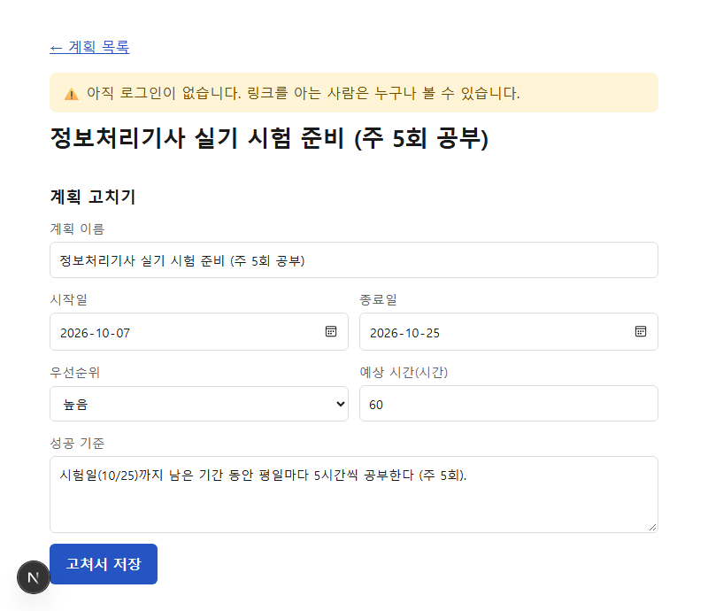
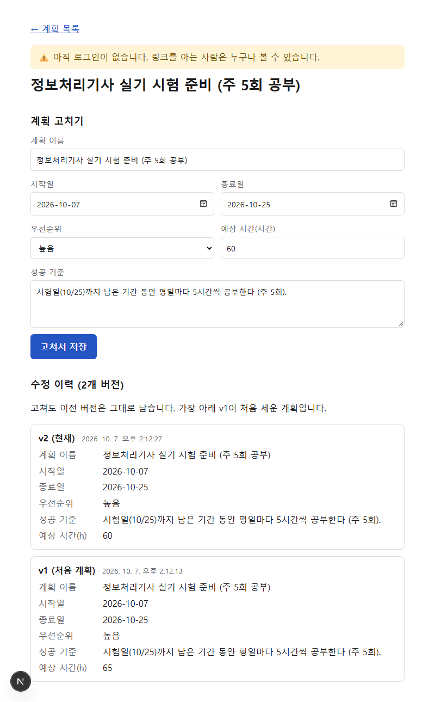

# 플랜두씨 다이어리 1 (과제 6)

> ⚠️ 아직 로그인이 없습니다. 링크를 아는 사람은 누구나 볼 수 있으니 남이 봐도 괜찮은 내용만 넣었습니다. (잠금은 7번 과제)

## 카드 1 — 계획 세우기

### 고른 계획
- 주제: **정보처리기사 실기 시험 준비** (주 5회 공부)
- 기간: 2026-10-07 ~ 2026-10-25 (시험일) / 우선순위: 높음
- 성공 기준: 시험일까지 남은 기간 동안 평일마다 5시간씩 공부한다
- 예상 시간: 처음 65시간(평일 13일 × 5시간) → 한글날(10/9)을 쉬기로 해 **60시간**으로 한 번 수정
- 선택 이유: 10/25 시험이 코앞이라 지금 실제로 가장 급한 일이어서

### 계획 항목 설계
| 항목 | 컬럼 | 설명 |
|---|---|---|
| ID | `id` | 계획 ID. 고쳐도 바뀌지 않음 |
| 기간 | `start_date`, `end_date` | 시작일~종료일 |
| 우선순위 | `priority` | 높음/보통/낮음 |
| 성공 기준 | `success_criteria` | 무엇이 되면 성공인지 |
| 예상 시간 | `estimated_hours` | 예상 소요 시간(h) |

### 수정 이력 저장 방식
- `plans`: 현재 값 (ID 고정, 내용만 갱신)
- `plan_revisions`: 계획의 모든 버전을 한 행씩 쌓는 이력 표 (`plan_id`, `revision_no`, 그 시점의 값 전체, `revised_at`)
- 처음 세운 계획은 `v1`로 저장되고, 고칠 때마다 `v2`, `v3`…이 추가됩니다. 지금 값과 예전 값이 따로 저장되어 고쳐도 `v1`은 그대로입니다.
- 이력은 앱 코드가 아니라 **DB 트리거**(`supabase/schema.sql`)가 남기므로, 어떤 경로로 고쳐도 빠지지 않습니다. 이력 행의 UPDATE는 막아 두었습니다.

## 남긴 것 (증거)

### 1. 내가 실제로 세운 계획이 저장된 화면

기간·우선순위·성공 기준·예상 시간이 모두 저장돼 보입니다.

### 2. 계획을 고친 이력이 남은 화면

예상 시간을 65h → 60h로 고쳤고, v1(처음 계획, 65h)과 v2(현재, 60h)가 함께 남아 있습니다. 새로고침 후에도 그대로입니다.

### 통과 기준 확인
- [x] T06-C04 기간이 저장된다
- [x] T06-C05 우선순위가 저장된다
- [x] T06-C06 성공 기준이 저장된다
- [x] T06-C07 예상 시간이 저장된다
- [x] T06-C08 고쳐도 고치기 전 계획이 그대로 남는다 (새로고침 후에도 확인)
