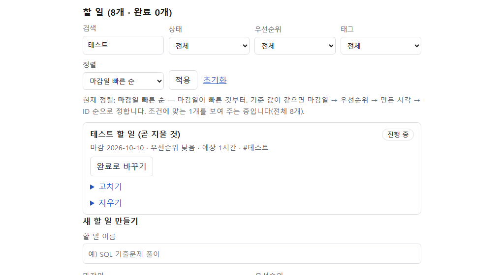
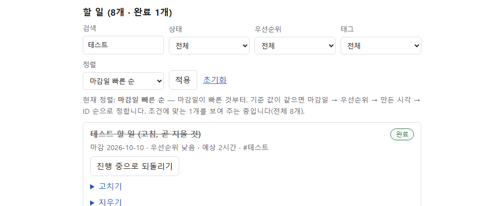
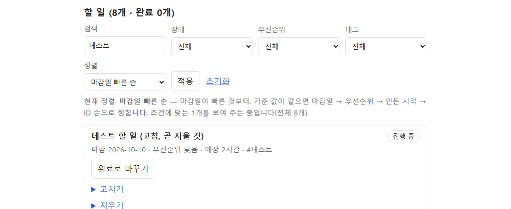
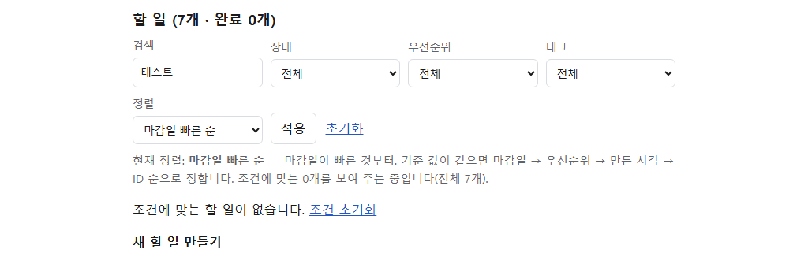
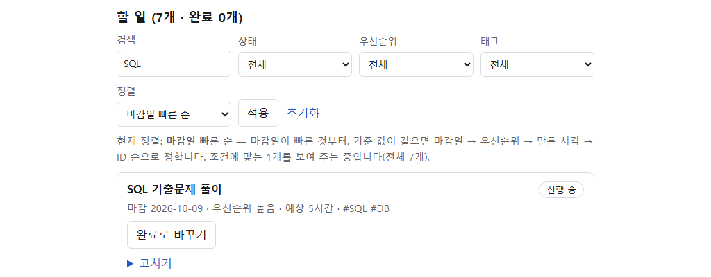
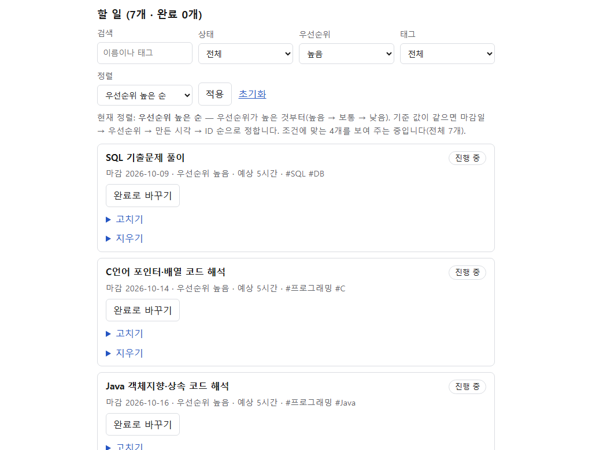
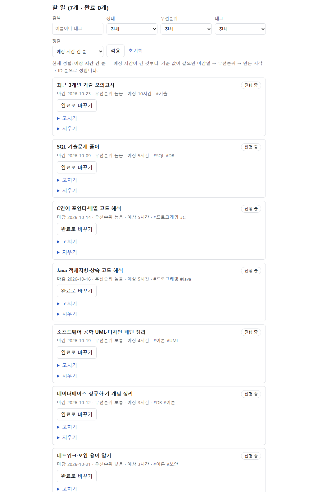

# 플랜두씨 다이어리 1 (과제 6)

- 결과물 주소: https://plan-do-see-06.vercel.app
- 소스 주소: https://github.com/terran1234/plan-do-see-06
- 스택: Next.js + Supabase(Postgres) + Vercel

> ⚠️ 아직 로그인이 없습니다. 링크를 아는 사람은 누구나 볼 수 있으니 남이 봐도 괜찮은 내용만 넣었습니다. (잠금은 7번 과제)

## 카드 1 — 계획 세우기

### 고른 계획
- 주제: **정보처리기사 실기 시험 준비** (주 5회 공부)
- 기간: 2026-10-07 ~ 2026-10-25 (시험일) / 우선순위: 높음
- 성공 기준: 시험일까지 남은 기간 동안 평일마다 5시간씩 공부한다
- 예상 시간: 처음 65시간(평일 13일 × 5시간) → 한글날(10/9)을 쉬기로 해 **60시간**으로 한 번 수정
- 선택 이유: 10/25 시험이 코앞이라 지금 실제로 가장 급한 일이어서

### 계획 항목 설계
| 항목 | 컬럼 | 설명 |
|---|---|---|
| ID | `id` | 계획 ID. 고쳐도 바뀌지 않음 |
| 기간 | `start_date`, `end_date` | 시작일~종료일 |
| 우선순위 | `priority` | 높음/보통/낮음 |
| 성공 기준 | `success_criteria` | 무엇이 되면 성공인지 |
| 예상 시간 | `estimated_hours` | 예상 소요 시간(h) |

### 수정 이력 저장 방식
- `plans`: 현재 값 (ID 고정, 내용만 갱신)
- `plan_revisions`: 계획의 모든 버전을 한 행씩 쌓는 이력 표 (`plan_id`, `revision_no`, 그 시점의 값 전체, `revised_at`)
- 처음 세운 계획은 `v1`로 저장되고, 고칠 때마다 `v2`, `v3`…이 추가됩니다. 지금 값과 예전 값이 따로 저장되어 고쳐도 `v1`은 그대로입니다.
- 이력은 앱 코드가 아니라 **DB 트리거**(`supabase/schema.sql`)가 남기므로, 어떤 경로로 고쳐도 빠지지 않습니다. 이력 행의 UPDATE는 막아 두었습니다.

## 남긴 것 (증거)

### 1. 내가 실제로 세운 계획이 저장된 화면

기간·우선순위·성공 기준·예상 시간이 모두 저장돼 보입니다.

### 2. 계획을 고친 이력이 남은 화면

예상 시간을 65h → 60h로 고쳤고, v1(처음 계획, 65h)과 v2(현재, 60h)가 함께 남아 있습니다. 새로고침 후에도 그대로입니다.

### 통과 기준 확인
- [x] T06-C04 기간이 저장된다
- [x] T06-C05 우선순위가 저장된다
- [x] T06-C06 성공 기준이 저장된다
- [x] T06-C07 예상 시간이 저장된다
- [x] T06-C08 고쳐도 고치기 전 계획이 그대로 남는다 (새로고침 후에도 확인)

---

## 카드 2 — 할 일 다루기

### 설계
| 항목 | 컬럼 | 설명 |
|---|---|---|
| 소속 | `plan_id` | 카드 1의 계획에 딸림 (계획이 지워지면 함께 삭제) |
| 마감일 | `due_date` | 필수 |
| 우선순위 | `priority` | 높음 / 보통 / 낮음 |
| 태그 | `tags` (text[]) | 쉼표로 구분, 최대 5개 |
| 예상 시간 | `estimated_hours` | 시간 단위 |
| 상태 | `status`, `completed_at` | 진행 중 ↔ 완료 (되돌리면 `completed_at` 비움) |

### 검색·거르기·정렬 기준 (화면에도 같은 문장이 적혀 있음)
- 처리 위치: **서버**(Next.js 서버 컴포넌트)에서 합니다. 화면은 결과만 그립니다. 조건은 주소(`?q=…&priority=…&sort=…`)에 담겨 새로고침·링크 공유해도 같습니다.
- 검색: 이름 또는 태그에 글자가 들어 있으면 일치 (대소문자 무시)
- 거르기: 상태 / 우선순위 / 태그 (여러 개를 함께 쓰면 모두 만족하는 것만)
- 정렬: 마감일 빠른 순(기본) · 우선순위 높은 순 · 예상 시간 긴 순 · 만든 순서
- **값이 같을 때**: 마감일 → 우선순위 → 만든 시각 → ID 순으로 정해서, 볼 때마다 순서가 바뀌지 않습니다.

### 실제로 넣은 할 일 (정보처리기사 실기 준비, 7개)
| 할 일 | 마감일 | 우선순위 | 태그 | 예상 시간 |
|---|---|---|---|---|
| SQL 기출문제 풀이 | 10/09 | 높음 | SQL, DB | 5h |
| 데이터베이스 정규화·키 개념 정리 | 10/12 | 보통 | DB, 이론 | 3h |
| C언어 포인터·배열 코드 해석 | 10/14 | 높음 | 프로그래밍, C | 5h |
| Java 객체지향·상속 코드 해석 | 10/16 | 높음 | 프로그래밍, Java | 5h |
| 소프트웨어 공학 UML·디자인 패턴 정리 | 10/19 | 보통 | 이론, UML | 4h |
| 네트워크·보안 용어 암기 | 10/21 | 낮음 | 이론, 보안 | 3h |
| 최근 3개년 기출 모의고사 | 10/23 | 높음 | 기출 | 10h |

## 남긴 것 (증거) — 카드 2

### 1. 할 일을 만들고·고치고·완료로 바꾸고·되돌리고·지운 화면
테스트용 할 일 하나로 처음부터 끝까지 따라갔습니다. (마지막에 지워서 7개만 남음)

| 단계 | 화면 |
|---|---|
| ① 만들기 |  |
| ② 고치기 (이름·예상 시간 1h → 2h) |  |
| ③ 완료로 바꾸기 |  |
| ④ 진행 중으로 되돌리기 |  |
| ⑤ 지우기 (전체 8개 → 7개) |  |

### 2. 검색·거르기·정렬이 밝혀 둔 기준대로 동작한 화면
- 검색 `SQL` → 1개: 
- 우선순위 `높음`만 + 우선순위 순 → 4개 (같은 우선순위는 마감일 순): 
- 예상 시간 긴 순 → 10h, 그다음 5h 세 개는 마감일 순(10/9 → 10/14 → 10/16), 3h 두 개도 마감일 순(10/12 → 10/21): 

### 통과 기준 확인
- [x] T06-C09 할 일을 만들 수 있다
- [x] T06-C10 할 일의 내용을 고칠 수 있다
- [x] T06-C11 할 일을 완료로 바꿀 수 있다
- [x] T06-C12 완료한 할 일을 다시 진행 중으로 되돌릴 수 있다
- [x] T06-C13 할 일을 지울 수 있다
- [x] T06-C14 마감일이 저장된다
- [x] T06-C15 우선순위가 저장된다
- [x] T06-C16 태그가 저장된다
- [x] T06-C17 예상 시간이 저장된다
- [x] T06-C18 검색할 수 있다
- [x] T06-C19 조건으로 걸러 볼 수 있다
- [x] T06-C20 화면에 밝힌 기준대로 정렬된다

---

## 카드 3 — 실제로 한 일 적기

### 설계
| 표 | 하는 일 |
|---|---|
| `execution_logs` (실행 기록) | 할 일(`todo_id`)에 이어진 **별도 표**. 시작 시각 · 끝난 시각 · 실제로 걸린 시간(분) · 막혔던 이유 · 요청 키(`request_key`, 유일) |
| `completions` (완료 기록) | 완료할 때마다 한 줄. 되돌리면 `reverted_at`만 채워 이력을 남김. 요청 키(`request_key`, 유일) |

- **계획을 덮어쓰지 않음**: 실행 기록은 `execution_logs`에만 쓰고 `plans`/`todos`의 계획 값(마감일·우선순위·예상 시간)은 건드리지 않습니다. 화면에는 계획의 "예상 시간"과 실행 기록의 "실제 합계"를 나란히 보여 줍니다.
- **완료 중복 방지 (DB가 막음, 버튼 잠금에 기대지 않음)**
  1. 화면이 만들어질 때마다 폼에 **요청 키**(UUID)를 넣고, 같은 키의 완료 요청은 DB `unique(request_key)`로 한 번만 받습니다.
  2. 키가 달라도 `unique (todo_id) where reverted_at is null` 인덱스 때문에 한 할 일에 **열린 완료 기록은 하나뿐**입니다.
  3. `complete_todo()` DB 함수가 할 일 행을 잠근 채(`FOR UPDATE`) 한 트랜잭션에서 처리하므로 동시에 눌러도 순서대로 처리됩니다.
- **돌아보기의 완료 수**: 할 일 표가 아니라 **열린 완료 기록**(`completions`)에서 직접 셉니다. 숫자를 누르면 `상태: 완료`로 거른 목록으로 이동합니다.

### 확인한 결과 (검증용 할 일 1개로 시험한 뒤 지움)
| 시험 | 결과 |
|---|---|
| 실행 기록 저장 (09:00~11:30, 실제 130분, 막힌 이유 입력) | 4항목 모두 저장, 화면에 "실제 2시간 10분" 표시 |
| 저장 후 계획 값 | 마감 10/08 · 낮음 · 예상 2.0h **그대로** (DB에서도 확인) |
| 완료 버튼 **연달아 2번** (서버에 POST 2번 도착) | 돌아보기 완료 수 0 → **1** (2가 아님) |
| 되돌린 뒤 다시 완료 버튼 연달아 2번 | 완료 수 0 → 1, 완료 기록 총 2행(닫힌 이력 1 + 열린 1) |
| 다른 요청 키로 완료 2번 더 호출 (SQL) | 둘 다 `false` (새 기록 안 생김), 열린 완료 기록은 1건 유지 |

### 통과 기준 확인
- [x] T06-C23 시작 시각 저장
- [x] T06-C24 끝난 시각 저장
- [x] T06-C25 실제로 걸린 시간 저장
- [x] T06-C26 막혔던 이유 저장
- [x] T06-C27 실행 기록을 저장해도 원래 계획 값은 그대로
- [x] T06-C21 완료 버튼을 연달아 두 번 눌러도 완료 기록 1건
- [x] T06-C22 돌아보기 완료 수도 1만 증가

### 남길 것 (증거) — 재촬영 때 실제 기록으로 채움
- [ ] 실행 기록이 어느 할 일에 붙어 있는지 보이는 화면
- [ ] 연달아 두 번 눌렀을 때도 기록 1건 · 집계 1회만 늘어난 결과

---

## 카드 4 — 돌아보기, 그리고 다음 계획으로

화면: `/plans/[계획 ID]/review` (계획 화면의 "돌아보기 화면으로" 링크)

### 집계 기준 (화면에도 같은 문장이 적혀 있음)
대상 = 마감일이 고른 기간(시작~끝, 기본은 계획 전체 기간) 안에 있는 할 일. 지운 할 일은 DB에 없으므로 자연히 빠집니다.

| 숫자 | 계산 | 통과 기준 |
|---|---|---|
| 계획 수 | 대상 할 일 수 | T06-C28 |
| 완료 수 | 그중 지금 완료 상태 | T06-C29 |
| 지연 수 | **완료가 아니고** 마감일이 서울 시간 오늘보다 앞. 완료한 할 일은 늦었어도 지연으로 세지 않음(완료로만 셈) | T06-C30 |
| 막힘 수 | 막힌 이유가 적힌 실행 기록이 하나라도 있는 **할 일 수** (같은 할 일에 막힘이 2건이어도 1) | T06-C31 |
| 예상 시간 | 대상 할 일의 예상 시간 합계 | T06-C32 |
| 실제 시간 | 그 할 일들의 실행 기록 합계 (기록이 없으면 0) | T06-C32 |
| 차이 | 실제 − 예상 (둘 다 **분**으로 맞춰 계산, 아무것도 없으면 0) | T06-C32 |

- 계획 화면의 요약에 있는 "막혔던 기록 N건"은 *실행 기록* 개수이고, 돌아보기의 "막힘 수"는 *할 일* 개수입니다. 단위가 달라서 이름도 다르게 붙였습니다.
- 주별(월요일 시작) 비교 표도 있고, 주별 합계는 전체와 항상 같습니다(같은 할 일을 두 번 세지 않음).

### 숫자 → 근거 기록 (T06-C83)
집계의 모든 숫자(전체 · 주별)가 링크입니다. 누르면 같은 화면 아래 "근거 기록"에 그 숫자를 이루는 할 일이 나오고, 할 일 이름을 누르면 계획 화면의 해당 할 일로 이동합니다.
- 계획·완료 수 → 해당 할 일 목록
- 지연 수 → 마감이 지난 할 일과 "N일 지연"
- 막힘 수 → 막힌 이유와 시각이 적힌 실행 기록
- 예상·실제·차이 → 할 일별 예상 vs 실제 + 실행 기록 목록 (기록 없는 할 일은 "실제 0으로 계산"이라고 표시)

### 고칠 점 한 줄 → 다음 계획 (T06-C33)
- 돌아보기 화면 아래 폼에 고칠 점 **한 줄**과 다음 계획의 마감일·우선순위·예상 시간을 적고 "다음 계획으로 넘기기"를 누릅니다.
- DB 함수 `carry_review()`가 **한 트랜잭션**으로 ① `reviews`에 고칠 점 + 그 시점 집계 숫자(snapshot) 저장 ② 새 할 일을 만들고(`source_review_id`로 돌아보기와 이음, 태그 `돌아보기`) 합니다.
- 같은 기간은 한 번만 넘어갑니다 (`unique(plan_id, period_from, period_to)`, 돌아보기 하나당 할 일 하나). 두 번 눌러도 1건.
- 넘어온 할 일에는 계획 화면에서 "돌아보기에서 넘어온 고칠 점" 표시가 붙습니다. 스냅샷은 서버가 DB에서 다시 계산해 저장하므로 폼 값을 조작할 수 없습니다.

### 확인한 결과
- **계산식 시험** `node lib/review.test.mjs` — 통과 기준 C28~C32의 계산, 기간 경계, 완료한 할 일의 지연 제외, 소수 시간(1.5h=90분), 서울 날짜 경계(UTC 16:00 → 다음 날), 주별 합 = 전체.
- **실제 화면 ↔ DB 독립 계산 대조** (지연·완료·막힘을 모두 포함한 검증용 할 일 2개를 넣고 확인한 뒤 삭제)
  | | 화면 | SQL로 DB에서 직접 계산 |
  |---|---|---|
  | 계획 / 완료 / 지연 / 막힘 | 9 / 1 / 1 / 1 | 9 / 1 / 1 / 1 |
  | 예상 / 실제 | 39시간 / 2시간 15분 | 2340분 / 135분 |
  | 차이 | −36시간 45분 | 135 − 2340 = −2205분 |
- 근거 기록 목록의 개수: 계획 9 · 완료 1 · 지연 1 · 막힘 1 — 모두 숫자와 일치. 완료한 할 일은 지연 목록에 없음.
- 고칠 점 넘기기 연달아 2번 → 돌아보기 1건·새 할 일 1건, 그때의 숫자(계획 2 · 완료 1 · 지연 1 · 막힘 1 · 예상 4시간 · 실제 2시간 15분)가 같이 저장됨.

### 통과 기준 확인
- [x] T06-C28 계획 수 = 지우지 않은 할 일 수
- [x] T06-C29 완료 수 = 완료 상태 할 일 수
- [x] T06-C30 지연 수 (서울 시간 기준 오늘, 완료한 것 제외)
- [x] T06-C31 막힘 수
- [x] T06-C32 예상·실제·차이 (분 단위 통일, 없으면 0)
- [x] T06-C83 숫자를 눌러 근거 기록으로 이동
- [x] T06-C33 고칠 점이 다음 계획으로 넘어감

### 남길 것 (증거) — 재촬영 때 실제 기록으로 채움
- [ ] 집계 화면과, 숫자를 눌러 도착한 근거 기록
- [ ] 다음 계획으로 넘어간 한 줄
