# 플랜두씨 다이어리 2 (과제 7) — 인증 구현 설명서

- 결과물 주소: https://plan-do-see-06.vercel.app (첫 화면은 로그인 화면)
- 소스 주소: https://github.com/terran1234/plan-do-see-06
- 스택: Next.js 16.4.0 + Supabase(Postgres + Auth) + Vercel

> 이 문서의 **카드 1**은 "무엇으로 붙였나·왜 골랐나"와 가입·로그인·로그아웃까지입니다. 아직 확인하지 못한 항목은 체크하지 않고 그대로 비워 두었습니다.
> 비밀번호·토큰·키 원문은 이 문서 어디에도 적지 않습니다. 환경변수는 이름만 적습니다.

## 인증 구현 설명서 (초안 — ⑤와 5일 기록은 아직 채우는 중)

아래 여섯 항목이 카드 1~5를 묶은 설명서다. 자세한 증거(화면·요청·응답)는 이 문서 아래쪽 카드별 "남긴 것"에 있고, 여기서는 그 위치를 가리킨다.

### ① 무엇으로 붙였나
**인증 서비스 Supabase Auth**(`@supabase/auth-js` 2.117.2)와 **세션 라이브러리 `@supabase/ssr`**(0.12.7), 프레임워크 Next.js 16.4.0이다. 직접 만든 것은 없다. 비밀번호 해시 저장(bcrypt, 비용 10), 토큰 발급·검증, 세션 삭제는 Supabase Auth가 하고, 내 코드는 그 결과를 받아 "로그인했는가", "이 자료가 내 것인가"만 판단한다.

### ② 왜 그걸 골랐나
6번에서 이미 Supabase를 DB로 쓰고 있어서, 사용자 표·비밀번호 해시·토큰 갱신을 따로 만들지 않고 같은 곳의 인증 서비스를 쓰는 편이 비밀번호를 직접 다루는 위험이 가장 적기 때문이다. 함께 검토하고 고르지 않은 방법은 **직접 구현**(해시·세션·만료를 전부 내 책임으로 지게 됨)과 **Auth.js**(이메일·비밀번호 로그인에 사용자 저장소를 따로 만들어야 해서 Supabase와 중복)다. 자세한 이유는 아래 카드 1.

### ③ 어디를 어떻게 고쳤나 — 네 흐름이 소스의 어디를 지나는가
모든 요청은 먼저 [`proxy.ts`](proxy.ts)를 지난다. 거기서 쿠키 속 토큰을 인증 서버에 물어(`getUser`, [`proxy.ts:50`](proxy.ts)) 로그인 여부를 확인하고, 로그인하지 않았으면 화면은 `/login`으로([`:58`](proxy.ts)), API는 401로([`:56`](proxy.ts)) 돌려보낸다.

| 흐름 | 소스를 지나는 순서 |
|---|---|
| **가입** | 가입 화면 폼 [`app/signup/page.tsx:19`](app/signup/page.tsx) → 서버 액션 [`app/auth-actions.ts:13`](app/auth-actions.ts) `signup`(이메일 형식·비밀번호 8~72자·확인 일치를 서버에서 검사) → [`:23`](app/auth-actions.ts) `supabase.auth.signUp` (Supabase Auth가 비밀번호를 bcrypt로 해시해 저장하고 세션 발급) → 세션 쿠키를 `httpOnly`로 저장 [`lib/supabase-auth.ts:15`](lib/supabase-auth.ts) → [`:33`](app/auth-actions.ts) 첫 화면으로. 같은 이메일이면 `user_already_exists`로 거절 |
| **로그인** | 로그인 화면 폼 [`app/login/page.tsx:29`](app/login/page.tsx) → [`app/auth-actions.ts:36`](app/auth-actions.ts) `login` → [`:42`](app/auth-actions.ts) `signInWithPassword` → 실패하면 아이디 없음·비밀번호 틀림 모두 **같은 문구**로 `/login?error=…` → 성공하면 쿠키 저장, [`:47`](app/auth-actions.ts) 첫 화면으로 |
| **로그아웃** | 헤더의 로그아웃 폼 [`app/UserBar.tsx:9`](app/UserBar.tsx) → [`app/auth-actions.ts:50`](app/auth-actions.ts) `logout` → [`:52`](app/auth-actions.ts) `signOut`(서버에서 세션을 지우고 쿠키도 지움) → [`:53`](app/auth-actions.ts) `/login`으로 |
| **자료 조회** | 요청 → [`proxy.ts:50`](proxy.ts) 로그인 확인 → 계획 화면 주소면 [`proxy.ts:63`](proxy.ts) 주인 확인(남의 것이면 404) → 화면 안에서 [`app/page.tsx:12`](app/page.tsx) `requireUser`, 목록은 [`:16`](app/page.tsx) `.eq('user_id', 내 번호)`, 계획 화면은 [`lib/ownership.ts:21`](lib/ownership.ts) `requireOwnedPlan`, 내보내기는 [`app/api/export/route.ts:11`](app/api/export/route.ts)·[`:16`](app/api/export/route.ts) |

쓰기(고치기·지우기)는 모두 [`app/actions.ts`](app/actions.ts), [`app/todo-actions.ts`](app/todo-actions.ts), [`app/review-actions.ts`](app/review-actions.ts)에서 저장하기 **전에** `requireOwnedPlan`/`requireOwnedTodo`를 부른다(줄 번호는 카드 4의 표). 계정 삭제는 [`app/account-actions.ts`](app/account-actions.ts) (`/account` 화면, 본인 계정만).

### ④ 안 열리는 것을 확인한 기록 — 확인 다섯 가지 (성공한 요청 · 거절된 요청)
모두 운영 주소(`https://plan-do-see-06.vercel.app`)에서 실제 세션으로 확인했다. 토큰·쿠키 값은 앞 5글자만 적었다.

| # | 확인 | 성공한 요청 | 거절된 요청 | 증거 |
|---|---|---|---|---|
| 1 | **로그인 없이 자료 화면** | 로그인 상태 `GET /` → **200**, 내 이메일이 화면에 있음 | 쿠키 없이 `GET /` → **307** → `/login`, `GET /api/export` → **401** | 카드 1, 카드 3 요청 A |
| 2 | **비밀번호** (맞는 값·틀린 값, 저장된 모습) | 맞는 이메일·비밀번호로 로그인 → 토큰 발급 | 틀린 비밀번호, 없는 이메일 → `POST /login` **303** → `/login?error=이메일 또는 비밀번호가 올바르지 않습니다.` (둘이 **같은 문구**). 저장된 값은 `$2a$10$…`(bcrypt)이고 같은 비밀번호여도 계정마다 소금값이 다르다 | 카드 1, 카드 2 |
| 3 | **로그아웃 뒤 같은 값** | 로그인 상태 `GET /` + 쿠키 `sb-…-auth-token=base6…생략` → **200** | 로그아웃 뒤 **같은 주소·같은 쿠키 값** → **307**. 만료(14:43) 전인 옛 토큰도 서버가 `session_not_found`(403)로 거절 | 카드 3 |
| 4 | **남의 자료** (읽기·수정·삭제, 양방향) | 내 목록·내 내보내기 **200**(내 자료만). *"같은 요청을 내 자료로 보내면 200·303"이라는 대조는 마지막 시험에 추가했고 아직 운영에서 돌리지 않았다* | 읽기 2종·수정 6종·삭제 2종, A→B와 B→A 모두 **404**. 거절 앞뒤로 피해자 자료 건수와 내용 지문이 같다 | 카드 4 |
| 5 | **목록에 남의 자료가 안 섞임** | 내 목록과 내 내보내기에 **내 자료만** (계획 번호가 모두 내 소유) | 주소·헤더·본문에 남의 계정 번호를 적어 보내도 남의 번호 **0개**. 로그인 없이는 **401** | 카드 4 |

### ⑤ AI와 나
(아래 "AI와 내 판단 3줄"과 같은 내용. 사실과 맞는지 제출자가 확인한 뒤에 확정한다.)

### ⑥ 아직 못 막은 것
"다 막았다"가 아니라 아래는 **아직 못 막았거나 확인하지 못한 것**이다. 각각 왜 위험한지 적는다.

| 못 막은 것 | 왜 위험한가 |
|---|---|
| **무차별 대입**: 비밀번호를 계속 바꿔 가며 시도하는 것을 내가 직접 막지 않는다. Supabase의 기본 제한에 맡겼고 그 동작은 확인하지 않았다 | 쉬운 비밀번호(규칙은 8자 이상뿐)를 쓴 계정은 시도를 반복해서 뚫릴 수 있다 |
| **비밀번호 재설정이 없다** | 비밀번호를 잊으면 계정을 복구할 방법이 없다. 반대로 이메일 확인 없이 재설정을 만들면 남이 내 계정을 가져갈 수 있어 일부러 만들지 않았다 |
| **두 번째 인증 수단(MFA)이 없다** | 비밀번호 하나가 알려지면 계정이 곧바로 넘어간다 |
| **로그를 직접 남기지 않는다**: 로그인 실패·거절된 요청을 앱이 따로 기록하지 않는다(서버 로그에는 요청이 남지만 알림도 분석도 없다) | 공격이 있어도 알아채지 못한다 |
| **가입할 때 이메일 확인을 껐다**(Confirm email 끔) | 남의 이메일로도 가입된다. 가입 화면은 "이미 가입된 이메일입니다"라고 알려 줘 어떤 이메일이 가입돼 있는지 알아낼 수도 있다 |
| **가입이 누구에게나 열려 있다** | 의미 없는 계정이 계속 만들어져도 막지 못한다 |
| **로그인 상태가 자동으로 끊기지 않는다**(세션 만료 설정이 무제한, 무료 플랜은 못 바꿈. 쿠키 400일) | 잃어버린 기기나 남이 쓴 컴퓨터에서 로그인이 오래 남는다 |
| **쿠키에 `Secure` 속성을 따로 붙이지 않았다** | https와 HSTS가 있어 위험은 작지만 쿠키가 https 전용으로 표시된 것은 아니다 |
| **주인 확인이 앱 코드에만 있고 DB의 행 보안(RLS)은 없다** | 앞으로 새 화면·API에서 확인을 빼먹으면 그대로 뚫린다 |
| **비밀번호를 바꾼 뒤 옛 세션이 끊기는지 확인하지 못했다**(변경 화면이 없음) | 바꿨는데 옛 로그인이 살아 있으면 비밀번호를 바꾸는 의미가 줄어든다 |
| 응답 시간 차이처럼 **존재 여부를 간접으로 알아내는 길**은 따져 보지 않았다 | 404로 숨겨도 시간 차이로 남의 자료의 존재를 추측할 수 있다 |

## 카드 1 — 무엇으로 붙일지 고르고, 이유를 적기

### 고른 방식: 인증 서비스 + 세션 라이브러리

| 구분 | 이름 | 버전 | 하는 일 |
|---|---|---|---|
| **인증 서비스** | Supabase Auth | `@supabase/auth-js` 2.117.2 (`@supabase/supabase-js` 2.117.2 안에 포함) | 가입, 비밀번호 해시 저장, 로그인 확인, 토큰 발급·갱신, 로그아웃 |
| 세션 라이브러리 | `@supabase/ssr` | 0.12.7 | 서버(Next.js)에서 로그인 상태를 쿠키로 읽고 쓰기 |
| 프레임워크 | Next.js | 16.4.0 | `proxy.ts`(예전 middleware)로 모든 요청 앞에서 로그인 확인 |

직접 구현은 아닙니다. 비밀번호를 해시해서 저장하는 일과 세션 토큰을 만들고 검증하는 일은 Supabase Auth가 하고, 내 소스는 그 결과를 받아 "로그인했는가"만 판단합니다.

### 왜 골랐나 (한 문장)
**6번에서 이미 Supabase를 DB로 쓰고 있어서, 사용자 표·비밀번호 해시·토큰 갱신을 따로 만들지 않고 같은 곳의 인증 서비스를 쓰는 편이 비밀번호를 직접 다루는 위험이 가장 적기 때문입니다.**

### 함께 검토했지만 고르지 않은 방법
| 방법 | 고르지 않은 이유 (한 문장) |
|---|---|
| **직접 구현** (bcrypt로 해시 + iron-session 같은 암호화 쿠키) | 해시 비용 설정, 세션 만료·갱신, 로그인 시도 제한까지 전부 내 책임이 되고 한 군데만 틀려도 계정이 뚫리는데, 이 과제의 핵심은 인증을 새로 발명하는 것이 아니라 붙인 것을 확인하는 것이라서 뺐습니다. |
| **Auth.js(NextAuth)** (라이브러리) | 이메일·비밀번호 로그인을 쓰려면 사용자 표와 해시 처리를 따로 만들어야 해서, 이미 Supabase에 있는 인증 기능과 중복되는 사용자 저장소가 하나 더 생기기 때문에 뺐습니다. |

### 어떻게 붙였나 (카드 1 범위)
| 하는 일 | 파일 |
|---|---|
| 가입·로그인·로그아웃 동작 | [`app/auth-actions.ts`](app/auth-actions.ts) |
| 로그인·가입 화면 | [`app/login/page.tsx`](app/login/page.tsx), [`app/signup/page.tsx`](app/signup/page.tsx) |
| 모든 요청 앞에서 로그인 확인, 없으면 `/login`으로 (화면은 307, API는 401) | [`proxy.ts`](proxy.ts) |
| 서버에서 "지금 누구인가" 확인 (`getUser()`로 인증 서버에 물어 위조 쿠키 차단) | [`lib/auth.ts`](lib/auth.ts), [`lib/supabase-auth.ts`](lib/supabase-auth.ts) |
| 세션 쿠키는 `httpOnly` (브라우저 스크립트가 못 읽음) | [`lib/supabase-auth.ts`](lib/supabase-auth.ts), [`proxy.ts`](proxy.ts) |
| 계획에 주인(`user_id`) 붙이기, 목록은 내 것만, 저장 시 내 id 기록 | [`supabase/schema.sql`](supabase/schema.sql) 맨 아래, [`app/page.tsx`](app/page.tsx), [`app/actions.ts`](app/actions.ts) |
| 내보내기(`/api/export`)를 내 자료만 내보내게 (고치기 전에는 **모든 사람의 자료 전체**를 내보냈음) | [`app/api/export/route.ts`](app/api/export/route.ts) |
| 6번 자료를 내 계정으로 옮기기 | [`supabase/migrate-owner.sql`](supabase/migrate-owner.sql) |

- 같은 이메일로 두 번 가입: 서버가 `user_already_exists`를 받으면 "이미 가입된 이메일입니다"로 거절합니다.
- 아이디 없음 / 비밀번호 틀림: Supabase가 둘 다 `invalid_credentials`로 돌려주고, 화면은 **같은 문구** "이메일 또는 비밀번호가 올바르지 않습니다."를 씁니다.
- 이메일·비밀번호는 주소(URL)에 싣지 않습니다. (오류 문구만 `?error=`로 전달)

## 남긴 것 (증거) — 카드 1

### 1. 고른 방식과 이름·버전, 고르지 않은 방법과 이유
위 표와 같습니다.

### 2. 로그인하지 않고 자료 화면 주소를 열었을 때 나오는 로그인 화면
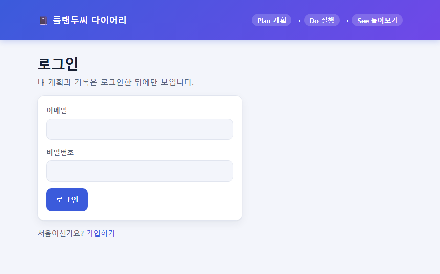
로그인하지 않고 `/`를 열었는데 주소가 `/login`으로 바뀌고 로그인 화면이 나온 모습입니다.

같은 일을 요청과 응답으로 적은 기록입니다. (쿠키 없이 요청, 이 컴퓨터에서 `next start`로 띄운 같은 소스, 2026-10-09)

```text
요청 (쿠키 없음)                                           응답
GET /                                                     307 → /login
GET /plans/00000000-0000-0000-0000-000000000000           307 → /login
GET /plans/00000000-0000-0000-0000-000000000000/review    307 → /login
GET /api/export                                           401 {"error":"로그인이 필요합니다."}
POST / (서버 액션 위조: Next-Action 헤더만 붙임)             307 → /login
GET /login                                                200
GET /signup                                               200
```

같은 확인을 **제출 주소(운영 서버)** 에서 다시 했습니다. (쿠키 없이 요청, 배포 직후, 2026-10-09 11:40)

```text
요청 (쿠키 없음)                       응답
GET https://plan-do-see-06.vercel.app/            307 → /login
GET https://plan-do-see-06.vercel.app/login       200
GET https://plan-do-see-06.vercel.app/signup      200
GET https://plan-do-see-06.vercel.app/api/export  401
```

### 3. 가입·로그인·로그아웃이 되는 화면
**가입.** 가입 화면에서 만든 계정이 Supabase 사용자 목록(Authentication → Users)에 가입 방식 Email, 2026-10-09 생성으로 한 건 올라 있는 것을 확인했습니다. 가입 직후 첫 화면까지 정상으로 열렸습니다.

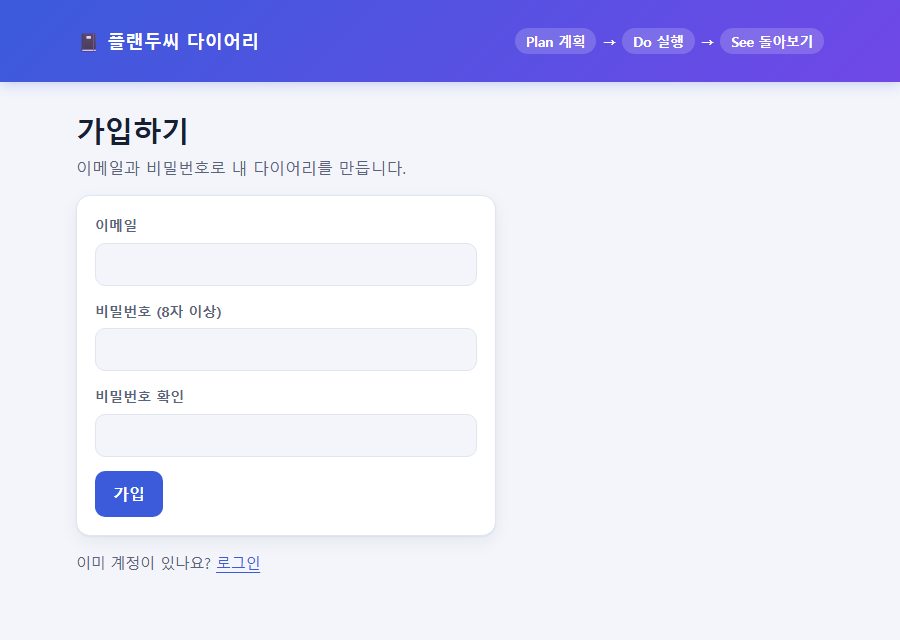

**로그인 성공.** 내 계정으로 로그인하면 헤더에 로그인한 이메일과 로그아웃 버튼이 보이고, 6번에서 넣어 둔 내 계획이 목록에 나옵니다. (연습용 계정의 이메일이라 가리지 않았습니다. 비밀번호는 어디에도 적지 않았습니다.)

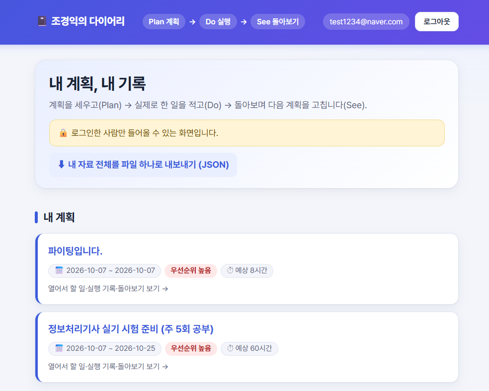

**로그아웃.** 로그아웃 버튼을 누르면 로그인 화면으로 돌아옵니다. (운영 주소, 로그아웃 직후)

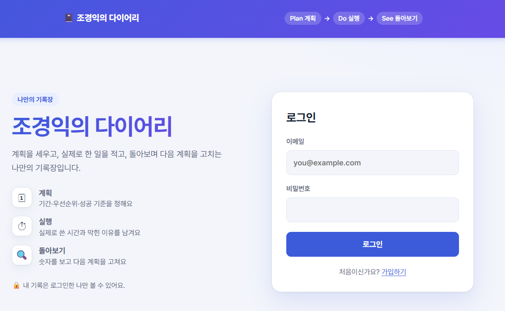

### 4. 틀린 로그인과 중복 가입 (운영 주소에서 직접 시도)
| 시도 | 입력 | 화면에 나온 문구 |
|---|---|---|
| ① 아이디는 맞고 비밀번호만 틀림 | 가입한 이메일 + 일부러 틀린 값 | **이메일 또는 비밀번호가 올바르지 않습니다.** |
| ② 아이디 자체가 없음 | 가입하지 않은 이메일 + 아무 값 | **이메일 또는 비밀번호가 올바르지 않습니다.** |
| ③ 같은 이메일로 다시 가입 | 이미 가입한 이메일 + 8자 이상 아무 값 | **이미 가입된 이메일입니다. 로그인해 주세요.** (가입되지 않고 거절) |

①과 ②의 문구가 글자까지 같아서, 어느 쪽이 틀렸는지 알려 주지 않습니다.

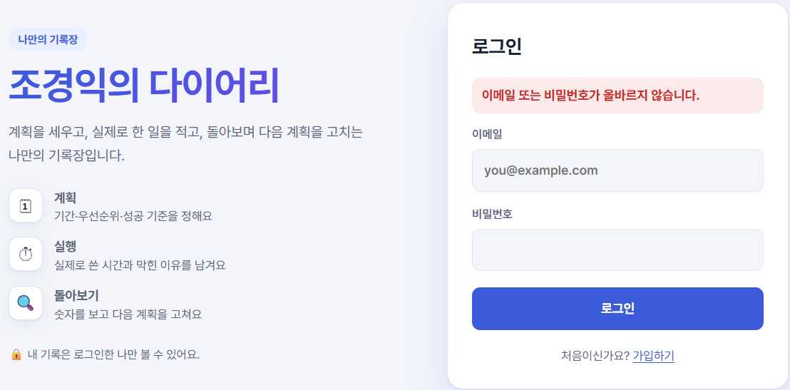
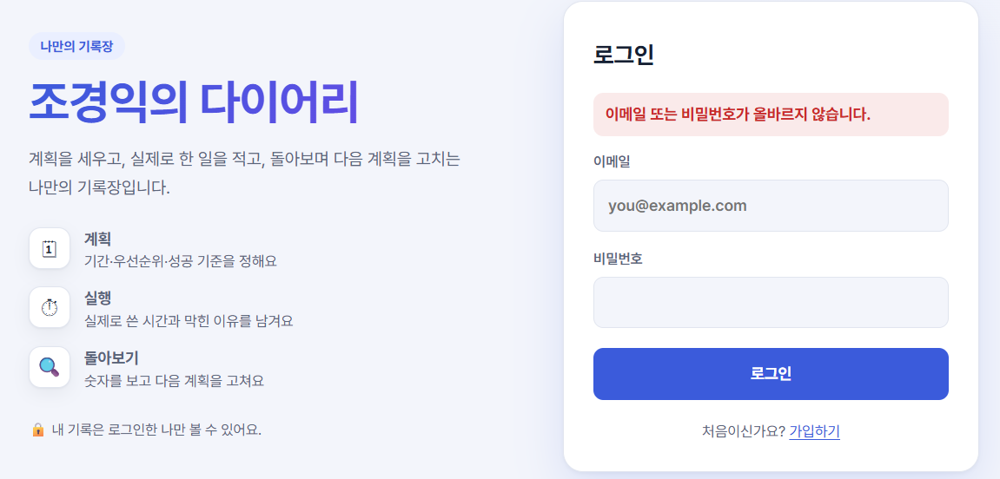
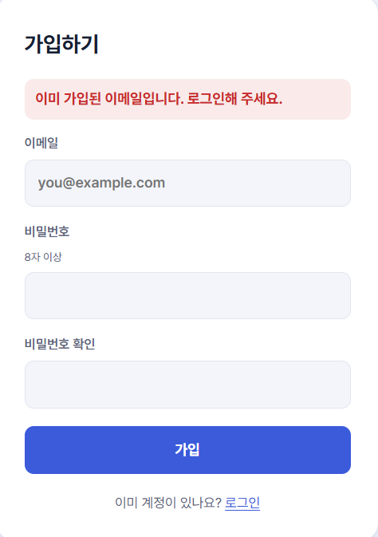

### 통과 기준 확인
- [x] T07-C91 인증을 무엇으로 붙였는지(인증 서비스 + 세션 라이브러리)와 이름이 적혀 있다
- [x] T07-C92 서비스·라이브러리의 이름과 버전이 적혀 있다
- [x] T07-C93 함께 검토한 방법(직접 구현, Auth.js)과 고르지 않은 이유가 적혀 있다
- [x] T07-C94 가입 화면에서 새 계정을 만들 수 있다 — 운영 주소에서 가입, 사용자 목록에서 확인
- [x] T07-C95 만든 계정으로 로그인할 수 있다 — 로그인 뒤 목록 화면 (위 3번)
- [x] T07-C96 로그아웃할 수 있다 — 로그아웃 후 로그인 화면 (위 3번)
- [x] T07-C97 로그인하지 않고 자료 화면 주소를 열면 로그인 화면이 나온다 — 운영 서버에서 확인 (위 2번)
- [x] T07-C98 같은 이메일로 두 번 가입되지 않는다 — 위 4번 ③
- [x] T07-C99 아이디 없음과 비밀번호 틀림의 안내 문구가 같다 — 위 4번 ①②
- [x] T07-C100 6번 자료가 내 계정으로 옮겨져 있다 — DB에서 센 결과(아래)와 로그인 후 목록 화면(위 3번)

### 6번 자료 이동 기록
6번에서 넣어 둔 계획을 내 계정 소유로 옮겼습니다. 옮긴 뒤 DB에서 센 결과입니다. (2026-10-09, Supabase SQL Editor)

```text
total  unowned  mine
2      0        2
```
- 전체 계획 2개 중 주인 없는 계획은 0개, 내 계정 소유가 2개입니다.
- 그 뒤 `plans.user_id`를 `not null`로 잠가, 앞으로 주인 없는 계획이 생기지 않게 했습니다.

### 카드 1 결과
통과 기준 T07-C91 ~ C100 열 개를 모두 확인했습니다.

### 이 카드에서 아직 막지 못한 것 (뒤 카드에서 이어서 다룸)
- 계획 **상세·할 일·돌아보기 화면과 수정·삭제 동작**은 아직 "로그인했는가"만 확인하고 "내 것인가"는 확인하지 않습니다. 로그인한 다른 사용자가 남의 계획 주소(UUID)를 알면 열 수 있는 상태입니다. 카드 2~에서 양방향 거절을 붙이고 증거를 남깁니다.
- 로그인 시도 횟수 제한은 Supabase 기본 설정에 맡기고 있고, 내가 따로 확인하지 않았습니다.
- **가입할 때 이메일 확인을 껐습니다** (Confirm email 끔). 그래서 남의 이메일로도 가입이 됩니다. 개인 앱이라 감수했지만, 이메일 주인임을 확인하지는 않습니다.
- 같은 이메일로 가입하면 "이미 가입된 이메일입니다"라고 알려 주기 때문에, 그 이메일이 가입돼 있는지 알아낼 수 있습니다. 로그인 쪽 문구는 같게 맞췄지만 가입 쪽은 아닙니다.
- 가입은 누구에게나 열려 있습니다.

## 카드 2 — 비밀번호를 어떻게 맡아 두는지 보이기

### 고른 방법: bcrypt (Supabase Auth가 적용)
| 항목 | 내용 |
|---|---|
| 되돌릴 수 없게 만드는 방법 | **bcrypt**, 비용(cost) 10 |
| 누가 하나 | 내가 만든 코드가 아니라 **인증 서비스(Supabase Auth)** 가 한다. 내 코드는 비밀번호를 받아 `signUp` / `signInWithPassword`로 넘길 뿐이다 |
| 어떻게 알았나 | 내 말이 아니라 **DB에 저장된 값**의 맨 앞이 `$2a$10$`이다. 이것이 bcrypt(비용 10)라는 표시다 (아래 사진) |

**고른 이유.** 비밀번호를 직접 해시하는 코드를 새로 만들면 비용 설정이나 소금값 처리에서 실수하기 쉬운데, bcrypt는 일부러 계산을 느리게 만들어 무차별 대입을 어렵게 하고 계정마다 다른 소금값을 **자동으로** 붙여 주는 널리 검증된 방법이라서, 내가 따로 만들지 않고 이것을 이미 쓰고 있는 인증 서비스에 맡겼다. (T07-C107: 비밀번호 처리를 직접 만들지 않았다.)

### 저장된 모습 (비밀번호가 글자로 보이지 않음)
bcrypt로 저장된 값은 60글자이고 이런 모양이다. **소금값은 해시와 같은 문자열 안에 함께 들어 있다.** 검사할 때는 저장된 값에서 소금값을 꺼내 입력한 비밀번호에 다시 섞어 비교한다.

```text
$2a$10$ ⟨소금값 22글자⟩ ⟨해시 31글자 …생략⟩
└──┬──┘
 bcrypt, 비용 10
```

DB의 `auth.users.encrypted_password`에서 **앞 29글자(방식·비용·소금값)와 전체 길이만** 읽었다. 해시 본문은 일부러 가져오지 않았다. (공개 저장소에 해시를 통째로 올리면, 비밀번호가 약할 때 밖에서 추측해 볼 수 있기 때문이다.)

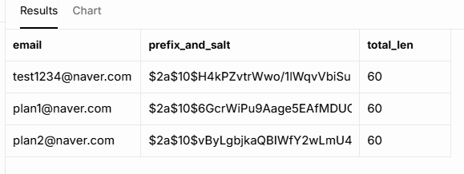

| 계정 | 저장값 앞부분 | 길이 |
|---|---|---|
| plan1 | `$2a$10$6GcrWiPu…` | 60 |
| plan2 | `$2a$10$vByLgbjk…` | 60 |
| test1234 | `$2a$10$H4kPZvtr…` | 60 |

입력한 글자는 어디에도 보이지 않고, 길이도 모두 60으로 같아서 비밀번호의 길이를 짐작할 수도 없다. (T07-C103)

### 같은 비밀번호로 만든 두 계정은 저장값이 다르다 (T07-C104)
`plan1`과 `plan2`는 **똑같은 비밀번호**로 가입했다. 그런데 소금값 부분이 `6GcrWiPu…`와 `vByLgbjk…`로 서로 다르고, 그래서 저장된 값 전체가 다르다. 한 계정의 비밀번호가 알려져도 같은 비밀번호를 쓴 다른 계정은 같은 값으로 드러나지 않는다.

> 비밀번호 자체는 이 문서에 적지 않았다.

### 로그인 요청과 응답에 원문이 남지 않는다 (T07-C105, C106)
실제 계정의 비밀번호를 쓰지 않고, **가짜 이메일과 가짜 비밀번호**로 운영 주소에 로그인 요청을 보내 응답을 기록했다. (2026-10-09 13:37, 비밀번호는 `●●●●●●●●`로 가렸다)

```text
요청   POST https://plan-do-see-06.vercel.app/login
       폼 값: email = nobody-demo@example.com
              password = ●●●●●●●●        (원문은 기록하지 않음)

응답   303 See Other
       Location: /login?error=이메일 또는 비밀번호가 올바르지 않습니다.
       Cache-Control: no-cache, no-store, max-age=0, must-revalidate
       Strict-Transport-Security: max-age=63072000; includeSubDomains; preload
       Set-Cookie: 없음 (로그인에 실패했으므로)
       응답 크기(본문): 0 bytes

검사   비밀번호 원문이 들어 있는가?
       응답 헤더       0건
       응답 본문       0건
       이동할 주소(URL) 0건
```

- **주소(URL)**: 이동 주소에는 오류 문구만 있고 이메일·비밀번호는 없다.
- **서버 로그**: Vercel 로그에는 시간, 메서드(POST), 상태 코드(303), 경로(`/login`)만 남는다. 요청 본문은 기록되지 않는다. 위 요청도 13:37:12에 한 줄로만 남아 있다. 내 코드에는 `console` 로그 호출이 0개이고, 비밀번호는 `auth-actions.ts`에서 `signUp`/`signInWithPassword`로만 넘어간다.

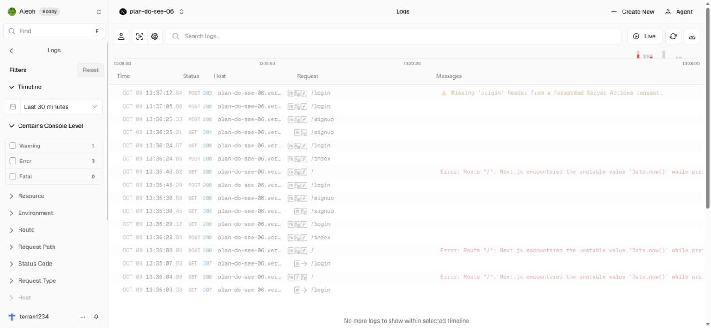

- **화면**: 비밀번호 입력칸은 `type="password"`라 점으로만 보이고, 오류 화면에도 입력한 이메일·비밀번호를 다시 보여 주지 않는다. (카드 1의 틀린 로그인 화면 참고)
- **쿠키**: 로그인에 성공하면 만들어지는 세션 쿠키는 `httpOnly`로 설정했다 (`lib/supabase-auth.ts`, `proxy.ts`). 브라우저의 스크립트는 읽을 수 없다.

### 통과 기준 확인
- [x] T07-C101 방법의 이름이 적혀 있다 — bcrypt
- [x] T07-C102 고른 이유가 한 문장 이상 적혀 있다
- [x] T07-C103 저장된 모습이 있고 입력한 글자가 보이지 않는다 — 앞 29글자(해시 본문은 가림)
- [x] T07-C104 같은 비밀번호로 만든 두 계정의 저장값이 다르다 — plan1 / plan2
- [x] T07-C105 로그인 요청·응답 기록에 비밀번호 원문이 없다 — 가짜 값으로 보낸 요청의 기록
- [x] T07-C106 서버 로그·화면·네트워크 응답 어디에도 원문이 없다 — 위 세 곳 확인
- [x] T07-C107 검증된 서비스에 맡겼고 직접 만들지 않았다

### 이 카드에서 아직 못 막은 것
- **로그인에 성공했을 때의 응답(쿠키가 발급되는 장면)** 은 요청·응답 기록으로 못 남겼다. 성공 요청을 보내려면 실제 비밀번호가 필요한데 그 값을 내 도구로 다루지 않기로 해서, 위 기록은 실패하는 요청 하나다. 브라우저에서 직접 로그인해 보면 정상으로 로그인되는 것은 카드 1에서 확인했다.
- 비밀번호 규칙은 **8자 이상**뿐이다. `12341234` 같은 쉬운 비밀번호도 통과한다.
- 로그인할 때 비밀번호는 **내 서버를 한 번 거쳐** Supabase로 넘어간다. 내 코드는 이를 저장하거나 기록하지 않지만, 요청을 처리하는 동안에는 서버 메모리에 존재한다.
- (조사·수정함) 카드 2를 쓸 때 서버 로그에 홈(`/`) 경로의 `Date.now()` 오류 줄이 보였다. 비밀번호와는 무관했고, 원인은 로그인 라이브러리의 시간 확인이었다. 수정과 확인은 카드 4 끝의 "서버 로그의 `Date.now()` 오류 조사와 수정" 참고.

## 카드 3 — 들어온 사람을 어떻게 기억하는지 보이기

### 무엇으로 사람을 알아보나 (T07-C108)
**서버 세션에 묶인 서명 토큰(JWT)으로 알아본다.** 로그인하면 Supabase Auth가 서버에 세션 한 줄(`auth.sessions`)을 만들고, 그 세션에 묶인 **access_token**(서명된 JWT, 60분)과 갱신용 **refresh_token**을 내준다. 앱은 이 둘을 `httpOnly` 쿠키(`sb-<프로젝트>-auth-token`)에 담고, **요청이 올 때마다** 쿠키의 토큰을 인증 서버에 물어 확인한다(`getUser()`, [`lib/auth.ts`](lib/auth.ts)). 쿠키 속 값을 그대로 믿지 않는다.

토큰만 믿으면 로그아웃해도 만료 시각까지 통하기 쉬운데, 서버 세션과 묶여 있어 **서버가 세션을 지우면 만료 전이어도 바로 끊긴다.** 아래 기록이 그 증거다.

### 같은 요청을 로그인 상태와 로그아웃 뒤에 나란히 (T07-C109, C110)
같은 주소(`GET https://plan-do-see-06.vercel.app/`), 같은 방식, **같은 쿠키 값**으로 두 번 요청했다. 두 요청 사이에 한 일은 **로그아웃뿐**이다. (2026-10-09 13:43, `plan1` 계정, [`scripts/session-check.ps1`](scripts/session-check.ps1)로 실행. 토큰·세션 값은 앞 5글자만 보이고 `…생략`으로 가렸다. 비밀번호는 기록에 없다.)

| | 요청 A (로그인 상태) | 요청 B (로그아웃 뒤) |
|---|---|---|
| 주소·방식 | `GET https://plan-do-see-06.vercel.app/` | `GET https://plan-do-see-06.vercel.app/` (**같음**) |
| 쿠키 | `sb-fdellxhmuhlgkbaeenbg-auth-token=base6…생략` | `sb-fdellxhmuhlgkbaeenbg-auth-token=base6…생략` (**같은 값**) |
| 응답 상태 | **200** | **307** → `/login` |
| 내 이메일이 화면에 있나 | 있음 | 없음 |

```text
=== 카드 3 세션 확인 (2026-10-09 13:43:28) ===
계정: plan1@naver.com   앱: https://plan-do-see-06.vercel.app

[1] 로그인 성공 → 서버가 세션을 만들어 토큰을 내줌
    access_token  : eyJhb…생략   (서명된 토큰, JWT)
    refresh_token : wlbtn…생략   (새 토큰을 받는 데만 쓰는 값)
    session_id    : 067c3…생략   (서버 DB의 세션 한 줄과 이어짐)
    발급 시각     : 2026-10-09 13:43:28
    만료 시각     : 2026-10-09 14:43:28   → 발급 후 3600초(60분)

[2] 요청 A (로그인 상태)
    GET https://plan-do-see-06.vercel.app/
    Cookie: sb-fdellxhmuhlgkbaeenbg-auth-token=base6…생략   (쿠키 값은 가림. 주소에는 토큰이 없음)
    → 응답 상태: 200   내 이메일이 화면에 있음: True   응답에 토큰 원문 있음: False

[3] 로그아웃 → 서버에서 세션 삭제   (응답 상태: 204)

[4] 요청 B (로그아웃 뒤, [2]와 같은 주소·같은 방식·같은 쿠키 값)
    GET https://plan-do-see-06.vercel.app/
    Cookie: sb-fdellxhmuhlgkbaeenbg-auth-token=base6…생략   (A와 같은 값)
    → 응답 상태: 307   이동할 주소: /login   내 이메일이 화면에 있음: False

[5] 만료 시각(14:43:28) 전인데도 옛 토큰이 통하는지 (지금 13:43:33)
    옛 access_token 으로 '나는 누구인가' 요청 → 상태 403  오류 코드: session_not_found
    옛 refresh_token 으로 새 토큰 요청        → 상태 400  오류 코드: refresh_token_not_found

요약: A=200 / B=307 / 옛 토큰=403 / 옛 refresh=400   → 로그아웃 뒤 이전 값이 통하지 않음: True
```

- 원본 출력 파일: [`scripts/session-check-output.txt`](scripts/session-check-output.txt)
- **서버에서 끊긴다.** [5]에서 옛 토큰은 만료 시각(14:43)이 한 시간 가까이 남았는데도 `session_not_found`로 거절됐고, 옛 refresh_token도 `refresh_token_not_found`로 거절됐다. 브라우저에서 쿠키만 지운 게 아니라 서버의 세션이 지워졌다는 뜻이다. (T07-C114 중 로그아웃)
- 로그아웃 호출은 앱의 로그아웃 버튼이 하는 일(`supabase.auth.signOut()`)과 같은 엔드포인트(`/auth/v1/logout`)다.

### 만료 시각과 끊기는 시간 (T07-C111)
| 값 | 만료 | 어떻게 확인했나 |
|---|---|---|
| access_token | **60분** (3600초) | 위 기록의 발급 13:43:28 → 만료 14:43:28, Supabase 설정 화면의 3600초와 같음 |
| refresh_token | 시각은 없고 **쓸 때마다 새 값으로 바뀐다**. 한 번 쓴 옛 값은 일정 시간 뒤 통하지 않는다 | Supabase 설정(재사용 간격) |
| 세션 전체 | 자동 만료 **없음** (설정값 0 = never, 무료 플랜은 바꿀 수 없음) | Supabase 설정 화면 |
| 브라우저 쿠키 | 400일 (`@supabase/ssr` 기본값) | 패키지 소스 |

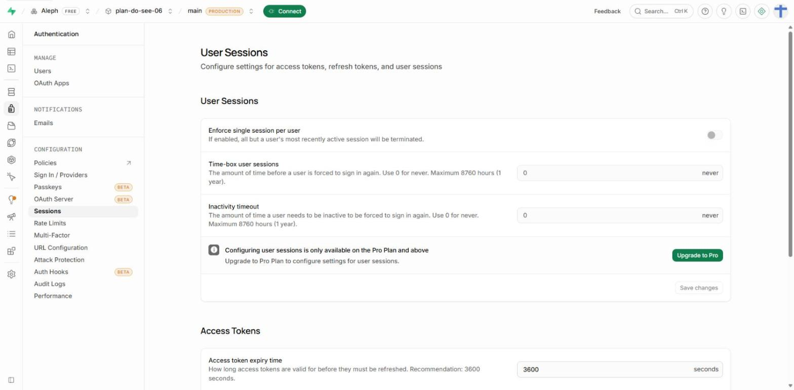

즉 **60분마다 토큰이 새로 발급돼야 하고**, 로그아웃하면 즉시 끊긴다. 다만 계속 접속하면 로그인 상태는 계속 갱신되어 유지된다. (아래 "못 막은 것")

### 값이 주소창에 실려 다니지 않는다 (T07-C112)
- 토큰은 쿠키에만 있다. 위 기록의 요청 주소는 `GET https://plan-do-see-06.vercel.app/`로 **주소에 토큰이 없다.**
- 카드 2의 로그인 응답에서도 이동 주소(`Location`)에는 오류 문구만 있었다.
- 쿠키는 `httpOnly`라 브라우저 스크립트가 읽을 수 없다. ([`lib/supabase-auth.ts`](lib/supabase-auth.ts), [`proxy.ts`](proxy.ts))

### 비밀키가 어디에도 새지 않았다 (T07-C113)
| 어디를 봤나 | 어떻게 | 결과 |
|---|---|---|
| **Git 기록 전체** | 모든 커밋에서 `sb_secret_…` / JWT 모양(`eyJ….….…`) / `SUPABASE_SERVICE_ROLE_KEY=…값` 검색 | **0건** (세 패턴 모두) |
| **추적 중인 env 파일** | `git ls-files` | `.env.example`(자리표시자)뿐. `.env*`는 `.gitignore` |
| **배포 파일(브라우저가 받는 것)** | 운영 주소의 `/login`·`/signup` HTML과 거기서 불러오는 정적 파일 9개(약 600KB)를 실제로 내려받아 검색 | `sb_secret_`, `service_role`, `SERVICE_ROLE`, `SUPABASE_ANON_KEY`, 공개 키(`sb_publishable_`), JWT 모양 모두 **0건** |
| **브라우저 코드** | 소스에서 `NEXT_PUBLIC_` 변수 사용 | 코드에서는 **0건**(주석에서만 언급). 키는 모두 서버 환경변수로만 쓴다 |

### 로그아웃 또는 비밀번호 변경 뒤 옛 값 (T07-C114)
- **로그아웃**: 위 기록처럼 옛 값이 통하지 않는다.
- **비밀번호 변경**: 이 앱에는 비밀번호를 바꾸는 화면이 없어서 **확인하지 못했다.** (기준이 "바꾸거나 로그아웃하면"이라 로그아웃으로 확인했다.)

### 기록에서 값이 가려져 있다 (T07-C115)
위 기록의 `access_token`·`refresh_token`·`session_id`·쿠키 값은 앞 5글자만 보이고 `…생략`이다. 비밀번호와 해시 본문, 키 원문은 이 문서 어디에도 없다.

### 통과 기준 확인
- [x] T07-C108 무엇으로 사람을 알아보는지 적혀 있다 — 서버 세션에 묶인 서명 토큰
- [x] T07-C109 로그인 상태의 성공 응답(200)과 로그아웃 뒤 거절 응답(307)이 나란히 있다
- [x] T07-C110 두 요청이 같은 주소·같은 방식·같은 쿠키 값이고 달라진 것은 로그아웃뿐이다
- [x] T07-C111 만료 시각이 있고 얼마 뒤 끊기는지 적혀 있다 — access_token 60분
- [x] T07-C112 값이 주소창에 실려 다니지 않는다
- [x] T07-C113 비밀키가 브라우저 코드·배포 파일·Git 기록에 없다
- [x] T07-C114 로그아웃하면 이전 값이 통하지 않는다 (비밀번호 변경은 화면이 없어 못 확인)
- [x] T07-C115 기록에서 토큰·세션 값이 가려져 있다

### 이 카드에서 아직 못 막은 것
- **로그인 상태가 자동으로 끊기지 않는다.** 세션 전체의 만료(time-box)와 비활동 만료가 "never"이고, 무료 플랜이라 바꿀 수 없다. 계속 쓰면 토큰이 계속 갱신된다. 쿠키도 400일 유지된다.
- **60분 뒤 access_token이 실제로 만료되는 장면은 기다려서 확인하지 못했다.** 만료 시각(3600초)은 발급된 토큰의 값과 Supabase 설정으로 확인한 것이다.
- **쿠키에 `Secure` 속성을 따로 붙이지 않았다.** 배포 주소는 https이고 Vercel이 `Strict-Transport-Security`(HSTS) 헤더를 보내 http 요청을 막지만, 쿠키 자체가 https 전용으로 표시된 것은 아니다.
- **비밀번호를 바꾼 뒤 옛 세션이 끊기는지는 확인하지 못했다.** 이 앱에 비밀번호 변경 기능이 없다.
- 로그아웃 증거 기록은 **스크립트가 같은 로그아웃 엔드포인트를 호출한 것**이다. 브라우저의 로그아웃 버튼을 누른 장면 자체의 요청·응답은 아니다. (버튼은 카드 1에서 눌러 로그인 화면으로 돌아오는 것을 확인했다.)

## 카드 4 — 남의 자료가 안 열리는 것을 보이기

화면에서 버튼을 숨긴 것이 아니라, **서버가 요청이 올 때마다 주인을 확인**한다. 남의 자료를 읽거나 고치거나 지우려는 요청은 아무것도 바꾸지 않고 **404**로 끝난다. (403이 아니라 404인 이유: 남의 자료가 *있다*는 사실조차 알려 주지 않으려고. 없는 번호와 남의 번호가 똑같이 404다.)

### 계정 두 개와 자료 (T07-C116)
계정 `plan1@naver.com`(A)과 `plan2@naver.com`(B)을 만들고, 각각에 자료를 넣었다. (**비밀번호는 적지 않았다.**)

| 계정 | 계획 | 할 일 | 실행 기록 |
|---|---|---|---|
| A (`plan1`) | 2개 (`[검증] A의 계획 1·2`) | 1개 | 1개 |
| B (`plan2`) | 2개 (`[검증] B의 계획 1·2`) | 1개 | 1개 |

자료는 [`scripts/ownership-check.mjs`](scripts/ownership-check.mjs)가 두 계정으로 로그인해 앱의 폼과 같은 요청으로 만들었다. 이 시험이 끝났을 때 각 계정에는 "남의 계정 번호를 본문에 적어 만든 계획" 1개가 더해져 계획이 3개씩 있다.

### 어떻게 시험했나
- 운영 주소(`https://plan-do-see-06.vercel.app`)에서, 2026-10-09 13:58~14:01, 두 계정으로 로그인한 **실제 세션 쿠키**를 써서 요청했다. 쿠키는 앞 5글자(`base6…생략`)만 적는다.
- 스크립트는 앱 화면의 폼에서 서버 액션 번호와 필드 이름을 읽어, 그 폼이 보내는 것과 같은 요청을 **대상 번호만 남의 것으로 바꿔서** 보낸다. (브라우저에서 남의 자료로 가는 버튼은 화면에 아예 없기 때문에, 요청을 직접 만들어 보냈다.)
- 전체 출력: [`scripts/ownership-check-output.txt`](scripts/ownership-check-output.txt) · 결과: **시험 36건 중 통과 36건, 실패 0건.**

### 읽기·수정·삭제 — 양방향 모두 거절 (T07-C117 ~ C121)
`A→B`는 A로 로그인해 B의 자료를 건드린 것, `B→A`는 반대다. 대상 번호는 앞 8글자만 적는다. 응답은 모두 **404**였다.

| 종류 | 요청 (남의 번호를 적어 보냄) | A→B | B→A |
|---|---|---|---|
| 읽기 | `GET /plans/<남의 계획>` | **404** | **404** |
| 읽기 | `GET /plans/<남의 계획>/review` | **404** | **404** |
| 수정 | 계획 고치기 `id=<남의 계획>` title="[침입] …" | **404** | **404** |
| 수정 | 할 일 고치기 `plan_id=…` `id=<남의 할 일>` | **404** | **404** |
| 수정 | 완료로 바꾸기 `status=완료` | **404** | **404** |
| 수정 | 남의 계획에 할 일 추가 | **404** | **404** |
| 수정 | 남의 할 일에 실행 기록 추가 | **404** | **404** |
| 수정 | 남의 계획에 돌아보기 넘기기 | **404** | **404** |
| 삭제 | 남의 실행 기록 삭제 `log_id=<남의 기록>` | **404** | **404** |
| 삭제 | 남의 할 일 삭제 | **404** | **404** |

출력에서 그대로 옮긴 부분 (A가 B의 자료를 건드린 첫 구간):

```text
━━ A (plan1@naver.com) 이(가) B (plan2@naver.com) 의 자료를 건드려 본다 ━━
  대상: 계획 158ce8bc… · 할 일 3c0402d9… · 실행 기록 627633d3…   (쿠키: sb-fdellxhmuhlgkbaeenbg-auth-token=base6…생략)
  ✔ [읽기] GET /plans/158ce8bc… → 404
  ✔ [수정] 계획 고치기   id=158ce8bc… title="[침입] 남의 자료를 바꾸려는 시도" → 404
  ✔ [수정] 할 일 고치기   plan_id=158ce8bc… id=3c0402d9… → 404
  ✔ [삭제] 실행 기록 삭제 plan_id=158ce8bc… todo_id=3c0402d9… log_id=627633d3… → 404
  ✔ [삭제] 할 일 삭제     plan_id=158ce8bc… id=3c0402d9… → 404
```

### 거절 앞뒤로 반대편 자료가 그대로다 (T07-C122)
위 시험을 하기 **전과 후**에, 피해 계정의 자료를 그 계정 자신의 세션으로 내려받아(내보내기 API) 건수와 내용의 지문(해시)을 비교했다.

| 피해 계정 | 앞 | 뒤 | 같은가 |
|---|---|---|---|
| B | 계획 2 · 할 일 1 · 실행 기록 1 · 완료 기록 0 · 돌아보기 0 · 수정 이력 2 (지문 `adb2500c85a3`) | 똑같음 (지문 `adb2500c85a3`) | **같음** |
| A | 계획 3 · 할 일 1 · 실행 기록 1 · 완료 기록 0 · 돌아보기 0 · 수정 이력 3 (지문 `7bbb9758819a`) | 똑같음 (지문 `7bbb9758819a`) | **같음** |

반대편에 `[침입]`이라는 제목의 자료가 새로 생기지 않았다. 지워지거나 바뀐 것도 없다. (거절이 *저장하기 전에* 일어난다는 뜻이다. 주인 확인이 쓰기보다 앞서 있다.)

### 주소·헤더·본문에 남의 계정을 적어 보내도 내 자료만 온다 (T07-C123)
| 어디에 적었나 | 요청 | 결과 |
|---|---|---|
| 주소 | `GET /?user_id=<남의 계정 번호>` | 200, 목록의 계획 2개 **모두 내 것**, 남의 번호 0개 |
| 헤더 + 주소 | `GET /api/export?user_id=<남의 계정>` + 헤더 `X-User-Id`, `X-Supabase-User-Id`, `X-Forwarded-User` | 200, 계획 2개 **모두 내 소유**, 남의 번호 0개 |
| 본문 | 계획 만들기 폼에 `user_id=<남의 계정 번호>`, `owner=<남의 이메일>`을 함께 적어 보냄 | 303(만들어짐). 새 계획의 주인은 **내 계정**(A→B 시험: `65e43516…` = A), 남의 계획 수는 2 → 2 그대로 |

앱은 주소·헤더·본문에서 계정을 읽지 않는다. 주인은 오직 **로그인한 세션에서 서버가 확인한 계정**이다. ([`app/actions.ts:46`](app/actions.ts) 계획을 만들 때 `user_id: user.id`)

### 로그인하지 않고 직접 요청 (T07-C124)
| 요청 (쿠키 없음) | 응답 |
|---|---|
| `GET /plans/<계획>` | **307** → `/login` |
| `GET /plans/<계획>/review` | **307** → `/login` |
| `GET /api/export` | **401** |
| `GET /` | **307** → `/login` |
| `POST` 계획 고치기 `id=<계획>` (서버 액션 요청) | **307** → `/login` |

시도 뒤 두 계정에 `[침입] 로그인 없이` 자료가 생기지 않았다.

### 목록에 남의 자료가 섞이지 않는다 (T07-C125)
| 목록을 부른 응답 | 검사 |
|---|---|
| A의 목록 화면 + A의 내보내기 응답 전체 | B의 번호 4개(계획·할 일·실행 기록) 중 **0개** 발견, B의 계획 제목 **발견 안 됨** |
| B의 목록 화면 + B의 내보내기 응답 전체 | A의 번호 4개 중 **0개** 발견, A의 계획 제목 **발견 안 됨** |

### 거절을 만들어 내는 소스 위치 (T07-C126)
| 하는 일 | 위치 |
|---|---|
| **주인 확인 함수** — 계획이 로그인한 사람의 것인지(`user_id`가 같은지) 묻고, 아니면 404. 오류가 나도 404(모르면 막는다) | [`lib/ownership.ts:21`](lib/ownership.ts) `requireOwnedPlan` · [`:30`](lib/ownership.ts) `requireOwnedTodo` |
| **남의 계획 화면 읽기를 HTTP 404로** — 화면을 그리기 전에 확인 | [`proxy.ts:11`](proxy.ts) · [`:15`](proxy.ts) `ownsPlan` · [`:62`](proxy.ts) 확인 후 404로 돌려보냄 |
| 계획 고치기 | [`app/actions.ts:58`](app/actions.ts) 확인 · [`:64`](app/actions.ts) 저장할 때도 `user_id` 조건을 한 번 더 |
| 할 일 만들기 | [`app/todo-actions.ts:72`](app/todo-actions.ts) |
| 할 일 고치기 | [`app/todo-actions.ts:84`](app/todo-actions.ts) |
| 완료로 바꾸기·되돌리기 | [`app/todo-actions.ts:103`](app/todo-actions.ts) |
| 실행 기록 추가 | [`app/todo-actions.ts:131`](app/todo-actions.ts) |
| 실행 기록 삭제 | [`app/todo-actions.ts:172`](app/todo-actions.ts) |
| 할 일 삭제 | [`app/todo-actions.ts:182`](app/todo-actions.ts) |
| 돌아보기 넘기기 | [`app/review-actions.ts:35`](app/review-actions.ts) |
| 계획·돌아보기 화면 안의 조각들(한 번 더) | [`app/plans/[id]/page.tsx:34`](app/plans/[id]/page.tsx), [`:52`](app/plans/[id]/page.tsx) · [`review/page.tsx:52`](app/plans/[id]/review/page.tsx) · [`TodoSection.tsx:203`](app/plans/[id]/TodoSection.tsx) |
| **목록**은 내 계정 것만 | [`app/page.tsx:16`](app/page.tsx) `.eq('user_id', user.id)` |
| **내보내기**는 내 계정 것만(계획 → 그 계획의 할 일 → 그 할 일의 기록 순으로 따라감) | [`app/api/export/route.ts:16`](app/api/export/route.ts) |

DB 접근에는 `service_role` 키를 쓰기 때문에 DB의 행 보안(RLS)이 대신 막아 주지 않는다. 그래서 위 확인이 **유일한 문**이다.

### 시험이 허술하지 않다는 대조 (고치기 전·후 같은 시험)
고치기 전 코드(카드 3 시점, 커밋 `2b24438`)에 **같은 시험**을 로컬 가짜 서버에서 돌렸다. (운영 서버에 일부러 뚫린 코드를 올리지는 않았다.)

| | 고치기 전 | 고친 뒤 (로컬) | 고친 뒤 (운영) |
|---|---|---|---|
| 시험 36건 | 통과 14 / **실패 22** | 36 / 0 | 36 / 0 |
| 남의 계획 읽기 | 200, **남의 계획 제목이 그대로 나옴** | 404 | 404 |
| 남의 자료 수정·삭제 | 303(성공) | 404 | 404 |
| B의 자료 앞뒤 | 할 일 1→2, 실행 기록 1→0, 돌아보기 0→1, `[침입]` 자료 생김 | 같음 | 같음 |

기록: [`scripts/ownership-check-before-fix-local-output.txt`](scripts/ownership-check-before-fix-local-output.txt) · [`scripts/ownership-check-after-fix-local-output.txt`](scripts/ownership-check-after-fix-local-output.txt) (이 둘은 가짜 서버에서 나온 것이라 제출 증거가 아니라 대조용이다.)

**고치다가 한 번 틀린 것.** 처음에는 남의 계획 화면 읽기가 **내용만 숨겨지고 HTTP 상태는 200**이었다(위 시험 36건 중 4건이 실패로 잡았다). 화면 안(`<Suspense>`)에서 `notFound()`를 던지면 이미 응답이 시작된 뒤라 상태가 바뀌지 않기 때문이다. 그래서 화면을 그리기 전인 `proxy.ts`에서 주인을 확인하도록 옮겨 404가 되게 했다.

### 통과 기준 확인
- [x] T07-C116 계정 두 개를 만들어 각각에 자료를 넣었고 그 사실이 적혀 있다. 비밀번호는 없다
- [x] T07-C117 한 계정으로 로그인해 다른 계정의 자료를 읽으려는 요청과 거절(404)
- [x] T07-C118 수정하려는 요청과 거절(404)
- [x] T07-C119 지우려는 요청과 거절(404)
- [x] T07-C120 반대 방향(B→A)도 읽기·수정·삭제 모두 거절
- [x] T07-C121 거절이 존재를 감추는 404로 이뤄진다
- [x] T07-C122 거절 앞뒤로 반대편 자료 건수와 내용이 같고, 새로 생긴 자료가 없다
- [x] T07-C123 주소·헤더·본문에 남의 계정을 적어 보냈는데도 내 자료만 돌아왔다
- [x] T07-C124 로그인하지 않은 직접 요청과 거절(307·401)
- [x] T07-C125 목록 응답에 남의 자료가 하나도 없다
- [x] T07-C126 거절을 만드는 소스 위치가 적혀 있다

### 이 카드에서 아직 못 막은 것
- **주인 확인이 앱 코드에만 있다.** DB는 `service_role` 키로 접근해서 RLS가 대신 막아 주지 않는다. 앞으로 새 화면이나 API를 만들 때 `requireOwnedPlan`을 빼먹으면 그대로 뚫린다. DB 단계의 방어(사용자 권한으로 접근 + RLS 정책)는 아직 없다.
- **`proxy.ts`의 확인은 `/plans/<번호>`와 `/plans/<번호>/review` 두 주소에만** 건다. 계획 주소가 새로 생기면 거기도 추가해야 한다.
- 이 시험은 **스크립트가 폼과 같은 요청을 직접 만들어 보낸 것**이다. 브라우저에서 클릭한 장면은 아니다. (브라우저에서는 남의 자료로 가는 버튼이 아예 없다.)
- **계획 삭제**는 시험하지 못했다. 이 앱에 계획을 지우는 기능이 없다. 할 일과 실행 기록 삭제만 시험했다. 완료 기록·수정 이력은 직접 부르는 주소가 없어 계획·할 일을 거쳐서만 닿는다.
- 404가 돌아오는 **응답 시간 차이**처럼 존재 여부를 간접으로 알아낼 수 있는 방법(부수 채널)은 따져 보지 않았다.
- 남의 자료를 건드리는 서버 액션 요청이 404로 거절될 때마다 서버 로그에 `Couldn't find all resumable slots…` 오류가 한 줄씩 남는다. 응답은 정상적인 404이고 정상 사용에서는 나지 않지만(아래 조사), 로그에 소음이 생긴다. 서버 액션 안에서 `notFound()`를 던지는 방식의 부작용이라, 상태를 404가 아닌 것으로 바꿔야 없앨 수 있어 그대로 두었다.

### 서버 로그의 `Date.now()` 오류 조사와 수정
**증상.** Vercel 로그에서, 로그인한 상태로 홈(`/`)과 계획 화면을 열 때마다 `Next.js encountered the unstable value 'Date.now()' while prerendering` 오류 줄이 찍혔다. 화면은 정상(200)이었다.

**원인.** 오류의 호출 경로(`__loadSession` → `_useSession` → `_emitInitialSession`)가 내 코드가 아니라 **로그인 라이브러리(auth-js)** 안이었다. 세션 쿠키가 있으면 만료를 확인하려고 `Date.now()`를 부르는데, 이 앱은 `cacheComponents`와 `partialPrefetching`을 켜 두었고 Next가 로그인한 사람용 화면을 미리 렌더링하는 동안에는 시간 값이 허용되지 않는다. 그래서 **로그인한 상태에서만** 났다.

**수정.** 오류 메시지가 안내한 방법대로, 로그인 클라이언트를 만드는 곳([`lib/supabase-auth.ts`](lib/supabase-auth.ts))에서 `await connection()`을 먼저 부른다. "이 부분은 요청이 올 때 그린다"는 표시라서 미리 렌더링할 때는 여기서 멈추고 실제 요청에서만 실행된다.

**확인(로컬 가짜 서버).** 같은 요청을 보낸 서버 로그에서 `Date.now` 오류가 **44건 → 0건**. 같은 시험(남의 자료 36건)도 **36건 모두 통과**를 유지했다. 정상 사용(내 목록·내 계획·내 돌아보기·내보내기 4요청)은 오류가 0건, 남의 계획 화면 읽기(GET)도 0건이었다.

## 카드 5 — 5일 동안 써 보기

### 6번과의 관계 (T07-C77, C78)
이 앱은 6번에서 만든 **같은 저장소·같은 운영 주소·같은 DB**에 인증을 이어 붙인 것이다. 새로 만든 앱이 아니다.

| 항목 | 값 |
|---|---|
| 이어서 사용한 최종 6번 결과 | 커밋 [`c926370`](https://github.com/terran1234/plan-do-see-06/commit/c926370) "최종 증거: 운영 주소에서 재촬영, 실제 기록 3건·고칠 점 반영, 제출문 확정" (2026-10-07 15:37, 서울) |
| 6번 결과물 주소 | https://plan-do-see-06.vercel.app (7번도 같은 주소) |
| 7번 소스 이력에 6번 최종 커밋이 조상으로 있나 | **있음.** `git merge-base --is-ancestor c926370 HEAD` → 참. 6번 이후 7번 커밋이 이어서 쌓였다 |
| 6번에서 넣어 둔 내 자료 | 7번에서 내 계정(`test1234`)의 소유로 옮김 (카드 1의 "6번 자료 이동 기록") |

> 6번 제출 때 실제로 낸 커밋이 위 `c926370`과 같은지는 제출자가 확인해야 한다. (이 문서는 6번 README의 마지막 커밋을 6번 최종으로 본다.)

### 1일차에 고정한 것 (T07-C04, C05, C06, C23 ~ C27)
**2026-10-09(금), 1일차에 한 번만 정하고, 이후 바꾸지 않는다.** 이 문단을 담은 커밋의 시각(`git log`)이 고정한 시각이다. 나중에 정의를 고쳐야 하면 고치지 않고 아래 "정의 변경 이력"에 이유와 함께 적는다.

| 항목 | 고정한 내용 |
|---|---|
| **답하려는 질문 (한 문장)** | 오전 10시에 시작해 오후 5시까지 공부하는 시간표로 하루에 실제로 몇 분을 공부하게 되고, 규칙을 하나 바꾸면 그 시간이 달라지는가? |
| **관찰 지표 (한 개)** | **하루 실제 공부 시간** |
| **단위** | **분** (min) |
| **계산 규칙** | ① "하루"는 **서울(Asia/Seoul) 달력 날짜**다. 실행 기록의 **시작 시각**이 속한 날짜로 센다(자정을 넘겨도 시작한 날에 전부). ② 그날의 값 = 그날 시작한 실행 기록들의 `actual_minutes`(실제로 걸린 시간, 분)를 **모두 더한 값**. ③ **5일 합계** = 5일의 값을 더한 것. **5일 평균** = 5일 합계 ÷ 5. ④ 규칙 변경 전(1~2일차)과 후(3~5일차)는 같은 ②를 쓰고, 평균은 **구간 합계 ÷ 구간 일수**(2일, 3일)로 계산한다 |
| **값이 빠졌을 때** (C23) | 그날 실행 기록이 하나도 없으면 그날은 **5일에 세지 않는다**(0분으로 채우지 않는다). 기록이 있는 서로 다른 날짜 5일을 채울 때까지 이어서 한다. 실행 기록 한 건에서 분이 비어 있으면 앱이 저장하지 않으므로 합계에 들어갈 일이 없다 |
| **값이 중복될 때** (C24) | 같은 저장 요청이 두 번 와도 **한 건만** 남는다(요청 키 `request_key`가 같으면 DB가 거른다). 서로 다른 두 기록의 시간대가 **겹치면**, 앱이 자동으로 빼지 않고 합계에 그대로 더한다. 겹침을 발견하면 사람이 한쪽을 지우고(실행 기록 삭제) 이유를 적는다 |
| **값이 유난히 튈 때** (C25) | 하루 합계가 **600분(10시간)을 넘거나**, 기록 한 건이 **360분(6시간)을 넘으면** 화면에서 **"튀는 값"으로 표시만** 한다. **제외하거나 고치지 않고** 합계·평균에 그대로 포함하며, 튄 이유를 한 줄 적는다 |
| **반올림** (C26) | 합계는 정수 분이라 반올림이 없다. **평균만 소수 첫째 자리에서 반올림**(0.5는 올림)해 **정수 분**으로 적는다. 시간으로 풀어 쓸 때는 반올림한 분을 60으로 나눈 몫과 나머지로 쓴다 |
| **주 시작 요일** (C27) | **월요일**. 주별 표는 월~일이 한 주다 |

**계획 규칙 (1~2일차에 따르는 규칙).** "오전 10시에 시작해서 오후 5시까지 공부한다. 중간에 점심시간이 있다."

3일차 기록을 남기기 **전에**, 1~2일차 결과를 보고 이 규칙을 **하나만** 바꾼다. 바꾼 시각·이유·바꾼 규칙은 앱의 돌아보기 기록(`reviews`)에 남기고, 아래 "규칙 변경 기록"에 옮긴다.

### 정의 변경 이력
(없음. 1일차에 고정한 뒤 바꾼 것이 생기면 여기에 날짜·이유와 함께 적는다.)

### 5일 사용을 위한 준비 (정의가 아니라 자료 정리)
- **할 일을 정보처리기사 실기의 10개 단원으로 나눴다.** 1단원 SW 개발/계획 ~ 10단원 Java, 제목에 문항 수가 들어 있다(예: `8단원 Python (24문항)`). 단원을 끝낼 때마다 "완료"로 바꿔 무엇이 남았는지 본다. 마감일은 모두 시험일 2026-10-25다.
- **"예상 시간"은 어림값이고 지표에 쓰지 않는다.** 앱이 필수로 요구하는 칸이라 **10문항 = 1시간, 0.5시간 단위로 반올림**해 넣었다(8시간, 4, 4.5, 4.5, 2, 3.5, 1.5, 2.5, 6, 5.5). 얼마나 걸릴지 모르기 때문에 이 값에는 의미를 두지 않는다. 5일 지표는 실행 기록의 실제 분만 쓴다. (생성 기록: [`scripts/add-units-output.txt`](scripts/add-units-output.txt))
- **6번에서 만든 기존 할 일 8개를 지웠다.** 5일 기록만 계정에 남기려는 것이다(이 카드는 "정확히 5일의 기록이 내 계정 안에"를 요구한다). 이 때문에 그 할 일에 붙어 있던 **6번의 실행 기록 3건(10/3·10/4·10/5)도 함께 지워졌다.** 지우기 전에 내보내기 파일로 백업했고, 6번 시점의 자료는 저장소의 [`docs/plan-do-see-export-2026-10-07.json`](docs/plan-do-see-export-2026-10-07.json)(실행 기록 3건 포함)과 6번 README에 그대로 남아 있다. 계획 두 개는 그대로다.
- 화면도 정리했다: 기본 화면에는 남은 할 일만, 완료한 것은 접어서 보여 주고, 맨 위에 완료 `n / 10`과 단원 타일, 오늘 공부 시간을 보여 준다.

### 5일 기록 (채우는 중)
서로 다른 서울 날짜 5일. 표는 그날의 실행 기록을 앱에 남긴 뒤에만 채운다. 값을 미리 적지 않는다.

| 일차 | 날짜(서울) | 그날 기록 건수 | 하루 실제 공부 시간(분) | 비고 |
|---|---|---|---|---|
| 1 | 2026-10-09 (금) | 1건 | **300분** (5시간) | 10:20 ~ 17:00, 8단원 Python. 계획 규칙은 10시 시작인데 실제 시작은 10:20이었다 |
| 2 | 2026-10-10 (토) | 1건 | **60분** (1시간) | 22:30 ~ 23:30, 8단원 Python. 낮에는 공부하지 못했고 밤에 1시간만 했다 |
| **(규칙 변경)** | 2026-10-11 01:15 | — | — | 2일차 기록(10/10 22:30~23:30) **뒤**, 3일차 기록 **앞**. 새 규칙: 오전 10시 정각에 시작한다 (아래 "규칙 변경 기록") |
| 3 | — | — | — | |
| 4 | — | — | — | |
| 5 | — | — | — | |

### 규칙 변경 기록 (T07-C09 ~ C12)
2일차 기록 뒤, 3일차 기록 앞에 계획 규칙을 **하나만** 바꿨다. 앱의 돌아보기 화면 "계획 규칙 바꾸기"에 직접 입력했고, 저장된 값은 운영 화면에서 읽어 확인했다.

| 항목 | 기록 |
|---|---|
| **바꾼 규칙 (하나)** | **오전 10시 정각에 시작한다** (1~2일차 규칙은 "오전 10시에 시작해서 오후 5시까지 공부한다, 중간에 점심시간") |
| **바꾼 시각** | **2026-10-11 01:15** (서울). 앱이 저장 순간에 기록한 시각(`reviews.created_at`)이다 |
| **바꾼 이유** | 시작 시간을 지킨 날(300분)과 못 지킨 날(60분)의 차이가 커서 |
| **가리키는 기록** | 1일차 10/09 **300분**(기록 1건), 2일차 10/10 **60분**(기록 1건) → 2일 합계 360분, 평균 180분. 저장할 때 이 기록들의 번호(`execution_logs.id`)가 함께 저장됐다 |
| **순서** | 2일차 기록(10/10 22:30~23:30) → 규칙 변경(10/11 01:15) → 3일차 기록은 아직 없다. 운영 화면의 전체 기간(10/7~10/25) 표에 10/09와 10/10만 있는 것을 확인했다 |

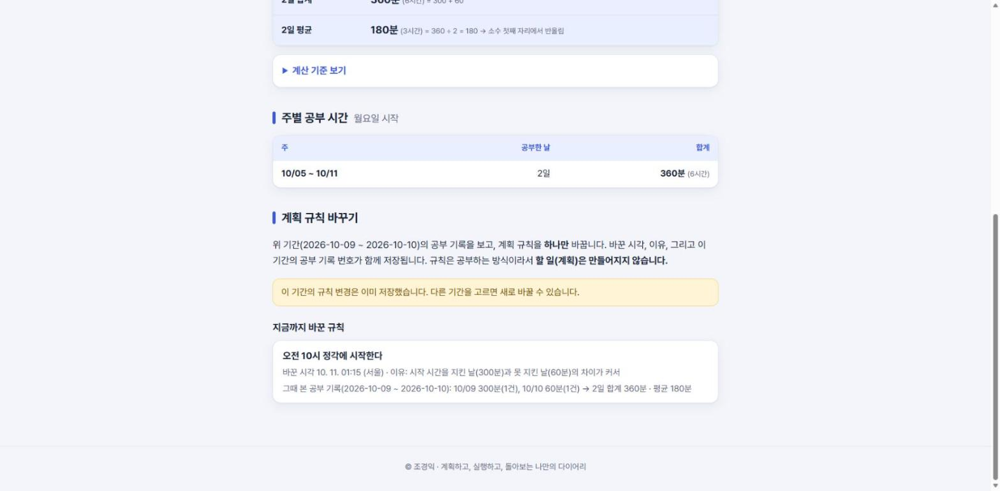

**만들다가 고친 것.** 처음에는 6번에서 만든 "고칠 점을 다음 계획(할 일)으로 넘기기" 폼으로 규칙을 남기게 했는데, 제출자가 "규칙은 계획이 아닌데 마감일·우선순위·예상 시간이 붙은 할 일이 만들어진다"고 지적했다. 맞는 지적이어서 **규칙 변경을 할 일과 분리**했다. 지금은 새 규칙·이유 두 칸만 받고 할 일을 만들지 않는다. 예상 시간 입력칸도 화면에서 뺐다(어림값이라 쓰지 않음, DB 필수 칸에는 자리표시 값만 넣는다).

**2일차는 늦게 채웠다.** 2026-10-10(토) 낮에는 공부하지 못했다. 그날 기록을 지어내지 않으려고 처음에는 "이 날은 5일에 세지 않는다"고 정리했는데(1일차에 고정한 규칙: 기록이 없는 날은 세지 않고 0분으로 채우지 않는다), 그날 밤에 실제로 1시간을 공부해서 기록을 남겼고 그 기록이 2일차가 됐다. 계획 규칙의 시간표(오전 10시~오후 5시)는 지키지 못한 날이다.

**1일차·2일차 화면** (운영 주소, 돌아보기 화면, 기간 10/7~10/25). 화면의 합계·평균이 기록과 같다. 1일차 기록 1건 300분, 2일차 기록 1건 60분 → **2일 합계 300 + 60 = 360분**, **평균 360 ÷ 2 = 180분**.

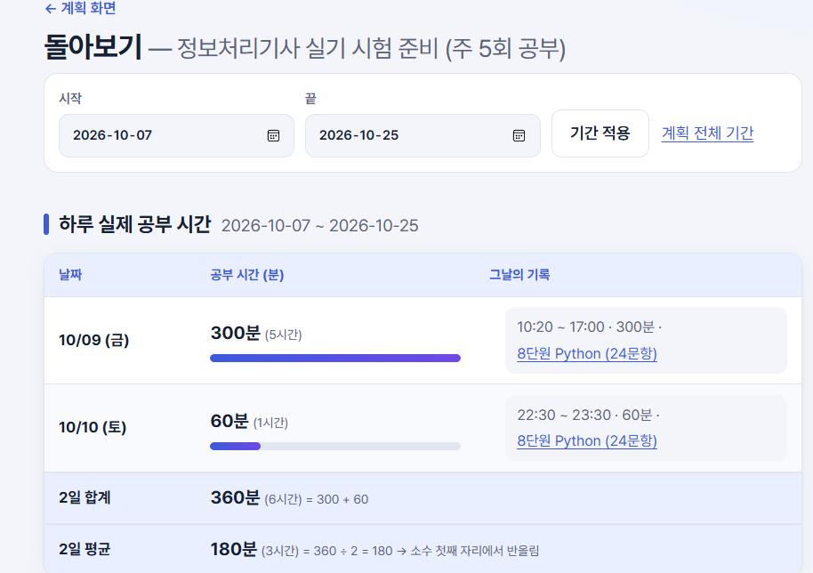

**1일차 화면** (운영 주소, 돌아보기 화면, 기간 10/9~10/9. 화면을 정리한 뒤 다시 캡처, 값은 같다). 화면의 합계·평균이 기록과 같다: 기록 1건 300분 → 1일 합계 300분, 평균 `300 ÷ 1 = 300`.

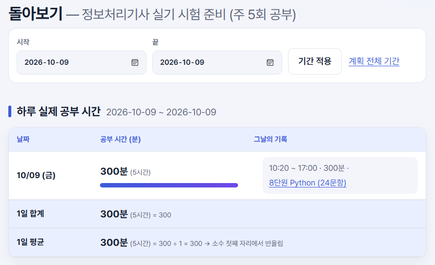

---

# (참고) 플랜두씨 다이어리 1 (과제 6) — 6번 제출 기록

- 스택: Next.js + Supabase(Postgres) + Vercel

> 아래는 6번 당시의 기록입니다. 6번 때는 로그인이 없었고, 7번에서 로그인을 붙였습니다.

> 아래 모든 화면 사진은 **제출 주소(운영 서버)에서 직접 촬영**했습니다. 파일은 [`docs/v2/`](docs/v2/)에 있습니다.

## 카드 1 — 계획 세우기

### 고른 계획
- 주제: **정보처리기사 실기 시험 준비** (주 5회 공부)
- 기간: 2026-10-07 ~ 2026-10-25 (시험일) / 우선순위: 높음
- 성공 기준: 시험일까지 남은 기간 동안 평일마다 5시간씩 공부한다
- 예상 시간: 처음 65시간(평일 13일 × 5시간) → 한글날(10/9)을 쉬기로 해 **60시간**으로 한 번 수정
- 선택 이유: 10/25 시험이 코앞이라 지금 실제로 가장 급한 일이어서

### 계획 항목 설계
| 항목 | 컬럼 | 설명 |
|---|---|---|
| ID | `id` | 계획 ID. 고쳐도 바뀌지 않음 |
| 기간 | `start_date`, `end_date` | 시작일~종료일 |
| 우선순위 | `priority` | 높음/보통/낮음 |
| 성공 기준 | `success_criteria` | 무엇이 되면 성공인지 |
| 예상 시간 | `estimated_hours` | 예상 소요 시간(h) |

### 수정 이력 저장 방식
- `plans`: 현재 값 (ID 고정, 내용만 갱신)
- `plan_revisions`: 계획의 모든 버전을 한 행씩 쌓는 이력 표 (`plan_id`, `revision_no`, 그 시점의 값 전체, `revised_at`)
- 처음 세운 계획은 `v1`로 저장되고, 고칠 때마다 `v2`, `v3`…이 추가됩니다. 지금 값과 예전 값이 따로 저장되어 고쳐도 `v1`은 그대로입니다.
- 이력은 앱 코드가 아니라 **DB 트리거**(`supabase/schema.sql`)가 남기므로, 어떤 경로로 고쳐도 빠지지 않습니다. 이력 행의 UPDATE는 막아 두었습니다.

## 남긴 것 (증거) — 카드 1

### 1. 내가 실제로 세운 계획이 저장된 화면
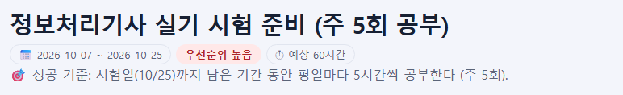
이름·기간·우선순위·예상 시간·성공 기준이 모두 저장돼 보입니다. (아래 수정 이력 화면에서 저장된 값 하나하나를 볼 수 있습니다.)

### 2. 계획을 고친 이력이 남은 화면
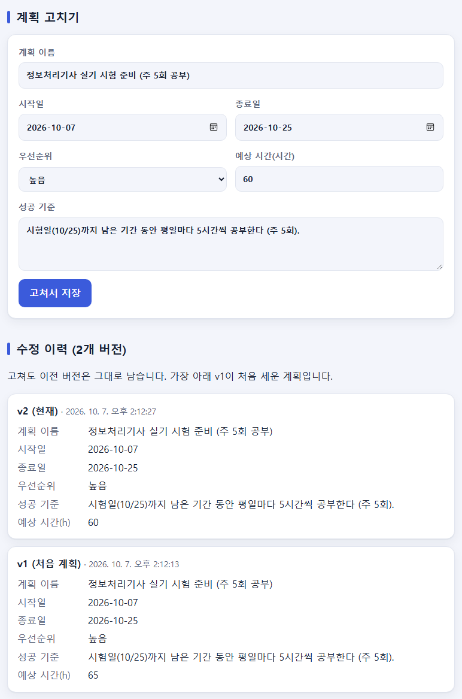
예상 시간을 65h → 60h로 고쳤고, v1(처음 계획, 65h)과 v2(현재, 60h)가 함께 남아 있습니다. 새로고침 후에도 그대로입니다.

### 통과 기준 확인
- [x] T06-C04 기간이 저장된다
- [x] T06-C05 우선순위가 저장된다
- [x] T06-C06 성공 기준이 저장된다
- [x] T06-C07 예상 시간이 저장된다
- [x] T06-C08 고쳐도 고치기 전 계획이 그대로 남는다 (새로고침 후에도 확인)

---

## 카드 2 — 할 일 다루기

### 설계
| 항목 | 컬럼 | 설명 |
|---|---|---|
| 소속 | `plan_id` | 카드 1의 계획에 딸림 (계획이 지워지면 함께 삭제) |
| 마감일 | `due_date` | 필수 |
| 우선순위 | `priority` | 높음 / 보통 / 낮음 |
| 태그 | `tags` (text[]) | 쉼표로 구분, 최대 5개 |
| 예상 시간 | `estimated_hours` | 시간 단위 |
| 상태 | `status`, `completed_at` | 진행 중 ↔ 완료 (되돌리면 `completed_at` 비움) |

### 검색·거르기·정렬 기준 (화면에도 같은 문장이 적혀 있음)
- 처리 위치: **서버**(Next.js 서버 컴포넌트)에서 합니다. 화면은 결과만 그립니다. 조건은 주소(`?q=…&priority=…&sort=…`)에 담겨 새로고침·링크 공유해도 같습니다.
- 검색: 이름 또는 태그에 글자가 들어 있으면 일치 (대소문자 무시)
- 거르기: 상태 / 우선순위 / 태그 (여러 개를 함께 쓰면 모두 만족하는 것만)
- 정렬: 마감일 빠른 순(기본) · 우선순위 높은 순 · 예상 시간 긴 순 · 만든 순서
- **값이 같을 때**: 마감일 → 우선순위 → 만든 시각 → ID 순으로 정해서, 볼 때마다 순서가 바뀌지 않습니다.

### 실제로 넣은 할 일 (정보처리기사 실기 준비, 7개)
| 할 일 | 마감일 | 우선순위 | 태그 | 예상 시간 |
|---|---|---|---|---|
| SQL 기출문제 풀이 | 10/09 | 높음 | SQL, DB | 5h |
| 데이터베이스 정규화·키 개념 정리 | 10/12 | 보통 | DB, 이론 | 3h |
| C언어 포인터·배열 코드 해석 | 10/14 | 높음 | 프로그래밍, C | 5h |
| Java 객체지향·상속 코드 해석 | 10/16 | 높음 | 프로그래밍, Java | 5h |
| 소프트웨어 공학 UML·디자인 패턴 정리 | 10/19 | 보통 | 이론, UML | 4h |
| 네트워크·보안 용어 암기 | 10/21 | 낮음 | 이론, 보안 | 3h |
| 최근 3개년 기출 모의고사 | 10/23 | 높음 | 기출 | 10h |

(+ 카드 4에서 "돌아보기에서 넘어온 고칠 점" 할 일 1개가 추가되어 지금은 8개)

## 남긴 것 (증거) — 카드 2

### 1. 할 일을 만들고·고치고·완료로 바꾸고·되돌리고·지운 화면
운영 서버에서 "연습용 할 일" 하나로 처음부터 끝까지 따라갔습니다. 마지막에 지워서 원래 8개로 돌아왔습니다.

| 단계 | 화면 |
|---|---|
| ① 만들기 (전체 9개가 됨) | 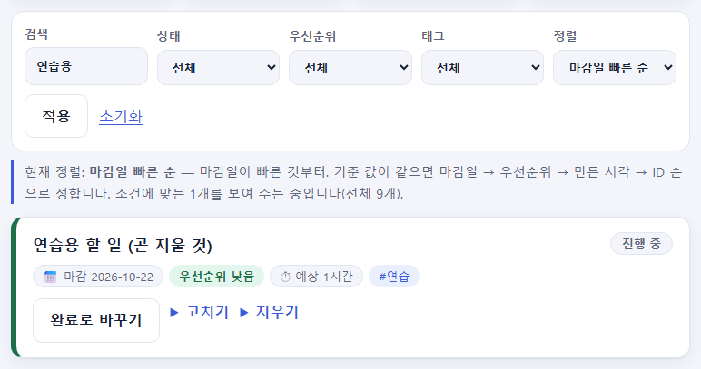 |
| ② 고치기 **전** — 고치기 폼을 연 모습 | 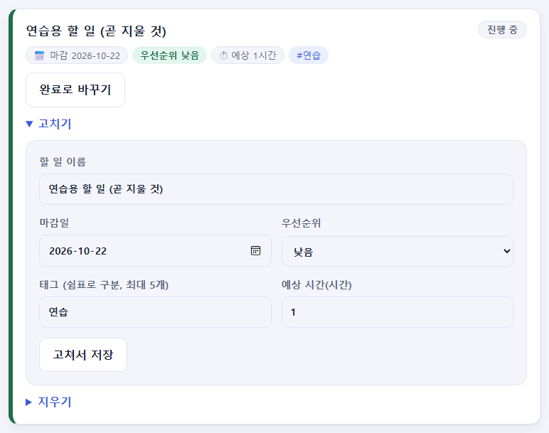 |
| ② 고친 **뒤** — 이름·우선순위 낮음→보통·예상 1h→2h·태그 추가 | 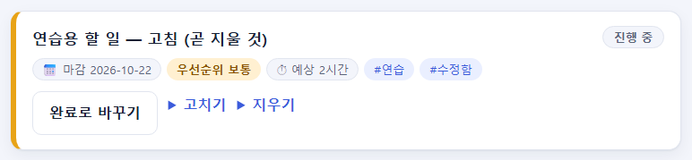 |
| ③ 완료로 바꾸기 (완료 버튼을 연달아 2번 눌렀음 → 카드 3 증거) | 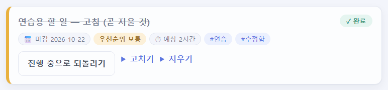 |
| ③ 상태 "완료"로 거른 화면 | 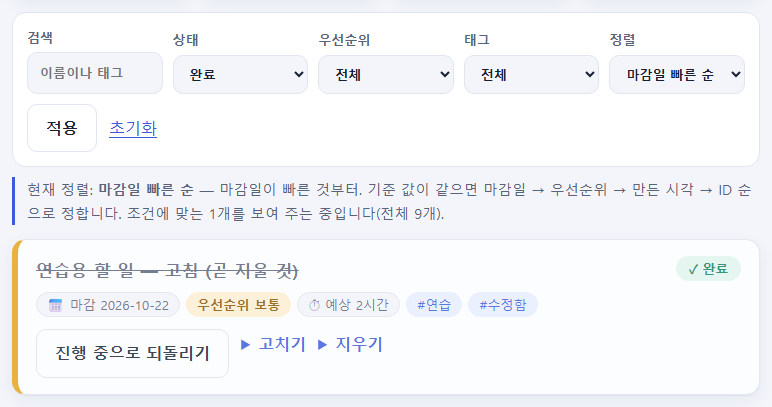 |
| ④ 진행 중으로 되돌리기 |  |
| ⑤ 지우기 (전체 9개 → 8개) | 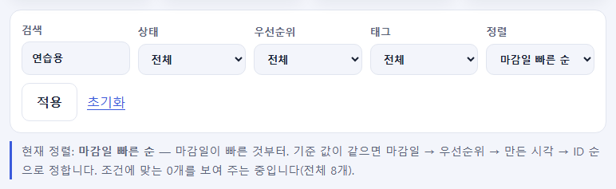 |

### 2. 검색·거르기·정렬이 밝혀 둔 기준대로 동작한 화면
(거르기·정렬 사진은 순서가 잘 보이도록 카드의 버튼 줄을 접은 채 촬영했습니다.)
- 검색 `SQL` → 1개: 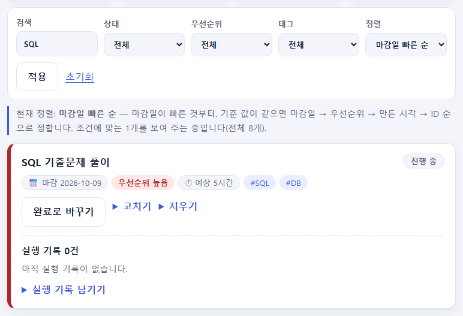
- 우선순위 `높음`만 + 우선순위 순 → 5개 (같은 우선순위는 마감일 순: 10/8 → 10/9 → 10/14 → 10/16 → 10/23): 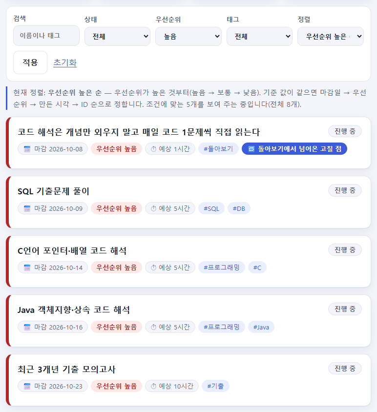
- 예상 시간 긴 순 → 10h, 5h 세 개는 마감일 순(10/9 → 10/14 → 10/16), 4h, 3h 두 개도 마감일 순(10/12 → 10/21), 마지막 1h: 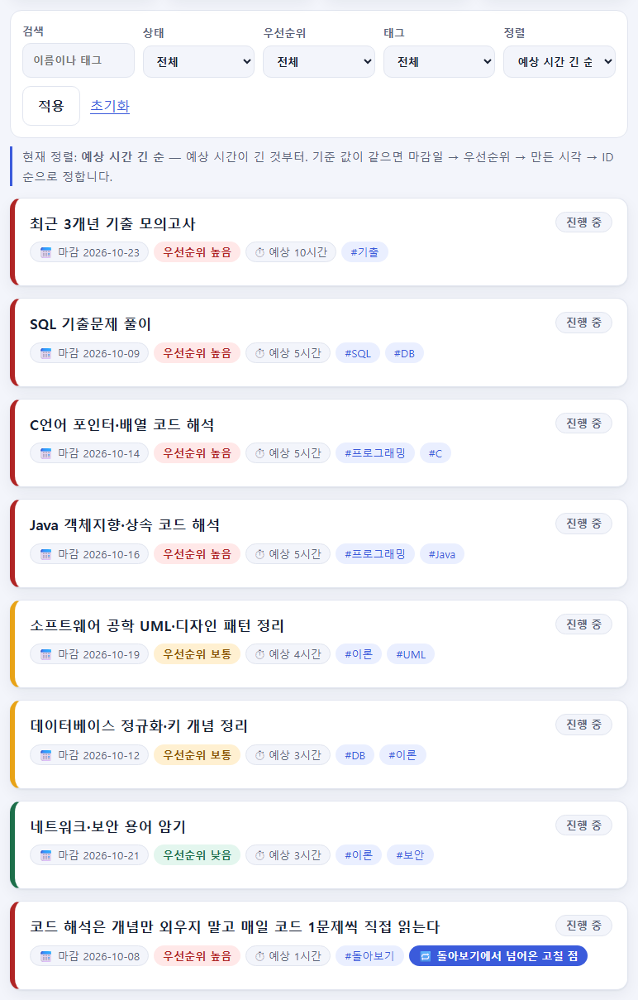

### 통과 기준 확인
- [x] T06-C09 할 일을 만들 수 있다
- [x] T06-C10 할 일의 내용을 고칠 수 있다
- [x] T06-C11 할 일을 완료로 바꿀 수 있다
- [x] T06-C12 완료한 할 일을 다시 진행 중으로 되돌릴 수 있다
- [x] T06-C13 할 일을 지울 수 있다
- [x] T06-C14 마감일이 저장된다
- [x] T06-C15 우선순위가 저장된다
- [x] T06-C16 태그가 저장된다
- [x] T06-C17 예상 시간이 저장된다
- [x] T06-C18 검색할 수 있다
- [x] T06-C19 조건으로 걸러 볼 수 있다
- [x] T06-C20 화면에 밝힌 기준대로 정렬된다

---

## 카드 3 — 실제로 한 일 적기

### 설계
| 표 | 하는 일 |
|---|---|
| `execution_logs` (실행 기록) | 할 일(`todo_id`)에 이어진 **별도 표**. 시작 시각 · 끝난 시각 · 실제로 걸린 시간(분) · 막혔던 이유 · 요청 키(`request_key`, 유일) |
| `completions` (완료 기록) | 완료할 때마다 한 줄. 되돌리면 `reverted_at`만 채워 이력을 남김. 요청 키(`request_key`, 유일) |

- **계획을 덮어쓰지 않음**: 실행 기록은 `execution_logs`에만 쓰고 `plans`/`todos`의 계획 값(마감일·우선순위·예상 시간)은 건드리지 않습니다. 화면에는 계획의 "예상 시간"과 실행 기록의 "실제 합계"를 나란히 보여 줍니다.
- **완료 중복 방지 (DB가 막음, 버튼 잠금에 기대지 않음)**
  1. 화면이 만들어질 때마다 폼에 **요청 키**(UUID)를 넣고, 같은 키의 완료 요청은 DB `unique(request_key)`로 한 번만 받습니다.
  2. 키가 달라도 `unique (todo_id) where reverted_at is null` 인덱스 때문에 한 할 일에 **열린 완료 기록은 하나뿐**입니다.
  3. `complete_todo()` DB 함수가 할 일 행을 잠근 채(`FOR UPDATE`) 한 트랜잭션에서 처리하므로 동시에 눌러도 순서대로 처리됩니다.
- **돌아보기의 완료 수**: 할 일 표가 아니라 **열린 완료 기록**(`completions`)에서 직접 셉니다. 숫자를 누르면 `상태: 완료`로 거른 목록으로 이동합니다.

### 확인한 결과 (검증용 할 일 1개로 시험한 뒤 지움)
| 시험 | 결과 |
|---|---|
| 실행 기록 저장 (09:00~11:30, 실제 130분, 막힌 이유 입력) | 4항목 모두 저장, 화면에 "실제 2시간 10분" 표시 |
| 저장 후 계획 값 | 마감 10/08 · 낮음 · 예상 2.0h **그대로** (DB에서도 확인) |
| 완료 버튼 **연달아 2번** (서버에 POST 2번 도착) | 돌아보기 완료 수 0 → **1** (2가 아님) |
| 되돌린 뒤 다시 완료 버튼 연달아 2번 | 완료 수 0 → 1, 완료 기록 총 2행(닫힌 이력 1 + 열린 1) |
| 다른 요청 키로 완료 2번 더 호출 (SQL) | 둘 다 `false` (새 기록 안 생김), 열린 완료 기록은 1건 유지 |

### 통과 기준 확인
- [x] T06-C23 시작 시각 저장
- [x] T06-C24 끝난 시각 저장
- [x] T06-C25 실제로 걸린 시간 저장
- [x] T06-C26 막혔던 이유 저장
- [x] T06-C27 실행 기록을 저장해도 원래 계획 값은 그대로
- [x] T06-C21 완료 버튼을 연달아 두 번 눌러도 완료 기록 1건
- [x] T06-C22 돌아보기 완료 수도 1만 증가

### 남길 것 (증거) — 카드 3

**1. 실행 기록이 어느 할 일에 붙어 있는지 보이는 화면** — 내가 실제로 공부한 기록 3건이 각 할 일 카드 안에 붙어 있습니다.

| 할 일 | 화면 |
|---|---|
| 최근 3개년 기출 모의고사 (10/5 10:00~17:00, 실제 5시간) — "실행 기록 남기기" 폼도 열어 둠 | 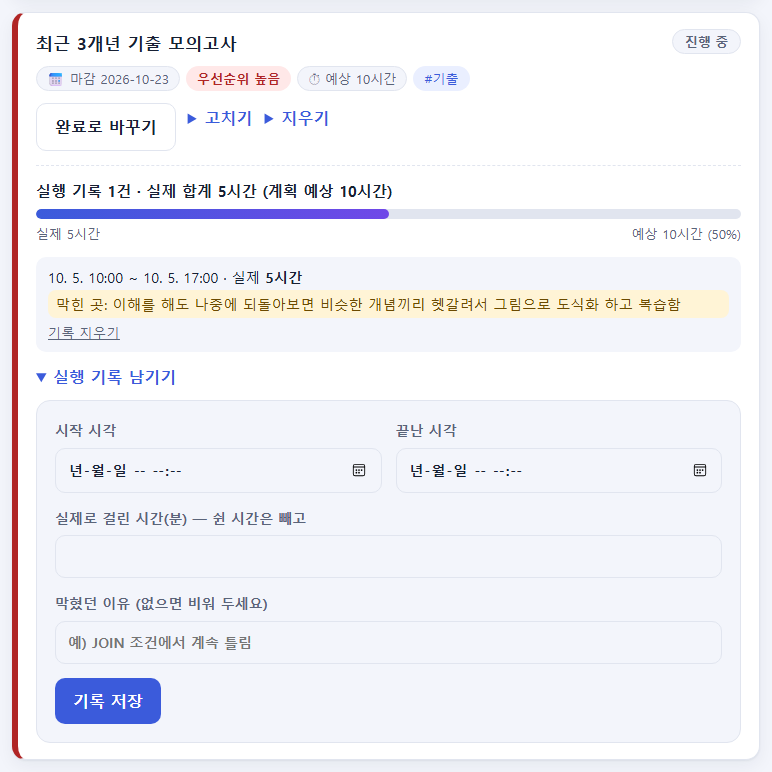 |
| Java 객체지향·상속 코드 해석 (10/3 14:00~19:00, 실제 4시간) | 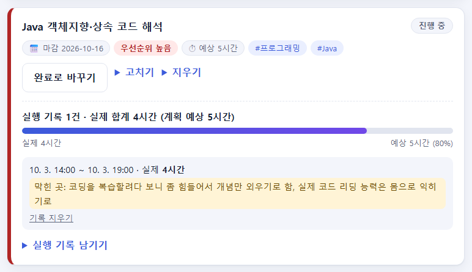 |
| 네트워크·보안 용어 암기 (10/4 11:00~17:00, 실제 4시간, 막힘 없음) | 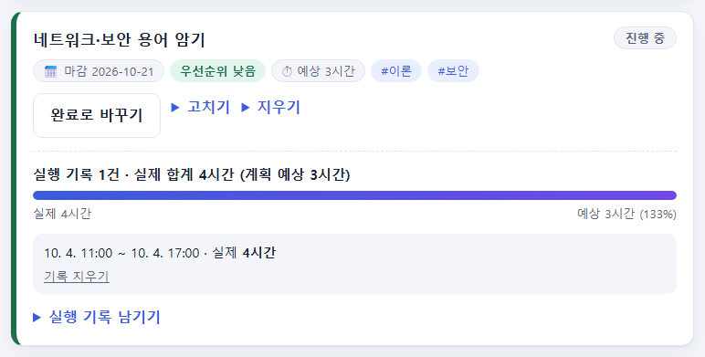 |

**2. 연달아 두 번 눌렀을 때도 기록 1건 · 집계 1회만 늘어난 결과** (운영 서버, 연습용 할 일에서 완료 버튼을 연달아 2번 제출)

| | 누르기 전 | 누른 뒤 |
|---|---|---|
| 돌아보기 완료 수 | 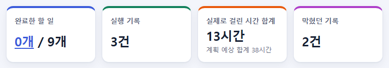 | 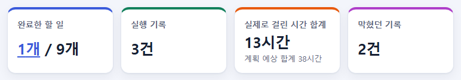 |
| 완료 기록 행 수 (내보내기 파일의 `completions`) | **0** | **1** (열린 기록 1, 2가 아님) |

(되돌린 뒤에는 그 1행이 닫힌 기록으로 남고 열린 기록은 0 — 이력은 남고 집계는 줄어듭니다. 연습용 할 일을 지울 때 함께 지워져 지금은 0행입니다.)

---
---

## 카드 4 — 돌아보기, 그리고 다음 계획으로

화면: `/plans/[계획 ID]/review` (계획 화면의 "돌아보기 화면으로" 링크)

### 집계 기준 (화면에도 같은 문장이 적혀 있음)
대상 = 마감일이 고른 기간(시작~끝, 기본은 계획 전체 기간) 안에 있는 할 일. 지운 할 일은 DB에 없으므로 자연히 빠집니다.

| 숫자 | 계산 | 통과 기준 |
|---|---|---|
| 계획 수 | 대상 할 일 수 | T06-C28 |
| 완료 수 | 그중 지금 완료 상태 | T06-C29 |
| 지연 수 | **완료가 아니고** 마감일이 서울 시간 오늘보다 앞. 완료한 할 일은 늦었어도 지연으로 세지 않음(완료로만 셈) | T06-C30 |
| 막힘 수 | 막힌 이유가 적힌 실행 기록이 하나라도 있는 **할 일 수** (같은 할 일에 막힘이 2건이어도 1) | T06-C31 |
| 예상 시간 | 대상 할 일의 예상 시간 합계 | T06-C32 |
| 실제 시간 | 그 할 일들의 실행 기록 합계 (기록이 없으면 0) | T06-C32 |
| 차이 | 실제 − 예상 (둘 다 **분**으로 맞춰 계산, 아무것도 없으면 0) | T06-C32 |

- 계획 화면의 요약에 있는 "막혔던 기록 N건"은 *실행 기록* 개수이고, 돌아보기의 "막힘 수"는 *할 일* 개수입니다. 단위가 달라서 이름도 다르게 붙였습니다.
- 주별(월요일 시작) 비교 표도 있고, 주별 합계는 전체와 항상 같습니다(같은 할 일을 두 번 세지 않음).

### 숫자 → 근거 기록 (T06-C83)
집계의 모든 숫자(전체 · 주별)가 링크입니다. 누르면 같은 화면 아래 "근거 기록"에 그 숫자를 이루는 할 일이 나오고, 할 일 이름을 누르면 계획 화면의 해당 할 일로 이동합니다.
- 계획·완료 수 → 해당 할 일 목록
- 지연 수 → 마감이 지난 할 일과 "N일 지연"
- 막힘 수 → 막힌 이유와 시각이 적힌 실행 기록
- 예상·실제·차이 → 할 일별 예상 vs 실제 + 실행 기록 목록 (기록 없는 할 일은 "실제 0으로 계산"이라고 표시)

### 고칠 점 한 줄 → 다음 계획 (T06-C33)
- 돌아보기 화면 아래 폼에 고칠 점 **한 줄**과 다음 계획의 마감일·우선순위·예상 시간을 적고 "다음 계획으로 넘기기"를 누릅니다.
- DB 함수 `carry_review()`가 **한 트랜잭션**으로 ① `reviews`에 고칠 점 + 그 시점 집계 숫자(snapshot) 저장 ② 새 할 일을 만들고(`source_review_id`로 돌아보기와 이음, 태그 `돌아보기`) 합니다.
- 같은 기간은 한 번만 넘어갑니다 (`unique(plan_id, period_from, period_to)`, 돌아보기 하나당 할 일 하나). 두 번 눌러도 1건.
- 넘어온 할 일에는 계획 화면에서 "돌아보기에서 넘어온 고칠 점" 표시가 붙습니다. 스냅샷은 서버가 DB에서 다시 계산해 저장하므로 폼 값을 조작할 수 없습니다.

### 확인한 결과
- **계산식 시험** `node lib/review.test.mjs` — 통과 기준 C28~C32의 계산, 기간 경계, 완료한 할 일의 지연 제외, 소수 시간(1.5h=90분), 서울 날짜 경계(UTC 16:00 → 다음 날), 주별 합 = 전체.
- **실제 화면 ↔ DB 독립 계산 대조** (지연·완료·막힘을 모두 포함한 검증용 할 일 2개를 넣고 확인한 뒤 삭제)
  | | 화면 | SQL로 DB에서 직접 계산 |
  |---|---|---|
  | 계획 / 완료 / 지연 / 막힘 | 9 / 1 / 1 / 1 | 9 / 1 / 1 / 1 |
  | 예상 / 실제 | 39시간 / 2시간 15분 | 2340분 / 135분 |
  | 차이 | −36시간 45분 | 135 − 2340 = −2205분 |
- 근거 기록 목록의 개수: 계획 9 · 완료 1 · 지연 1 · 막힘 1 — 모두 숫자와 일치. 완료한 할 일은 지연 목록에 없음.
- 고칠 점 넘기기 연달아 2번 → 돌아보기 1건·새 할 일 1건, 그때의 숫자(계획 2 · 완료 1 · 지연 1 · 막힘 1 · 예상 4시간 · 실제 2시간 15분)가 같이 저장됨.

### 통과 기준 확인
- [x] T06-C28 계획 수 = 지우지 않은 할 일 수
- [x] T06-C29 완료 수 = 완료 상태 할 일 수
- [x] T06-C30 지연 수 (서울 시간 기준 오늘, 완료한 것 제외)
- [x] T06-C31 막힘 수
- [x] T06-C32 예상·실제·차이 (분 단위 통일, 없으면 0)
- [x] T06-C83 숫자를 눌러 근거 기록으로 이동
- [x] T06-C33 고칠 점이 다음 계획으로 넘어감

### 남길 것 (증거) — 카드 4

**1. 집계 화면** (내 계획·할 일 8개·실행 기록 3건으로 채워짐)
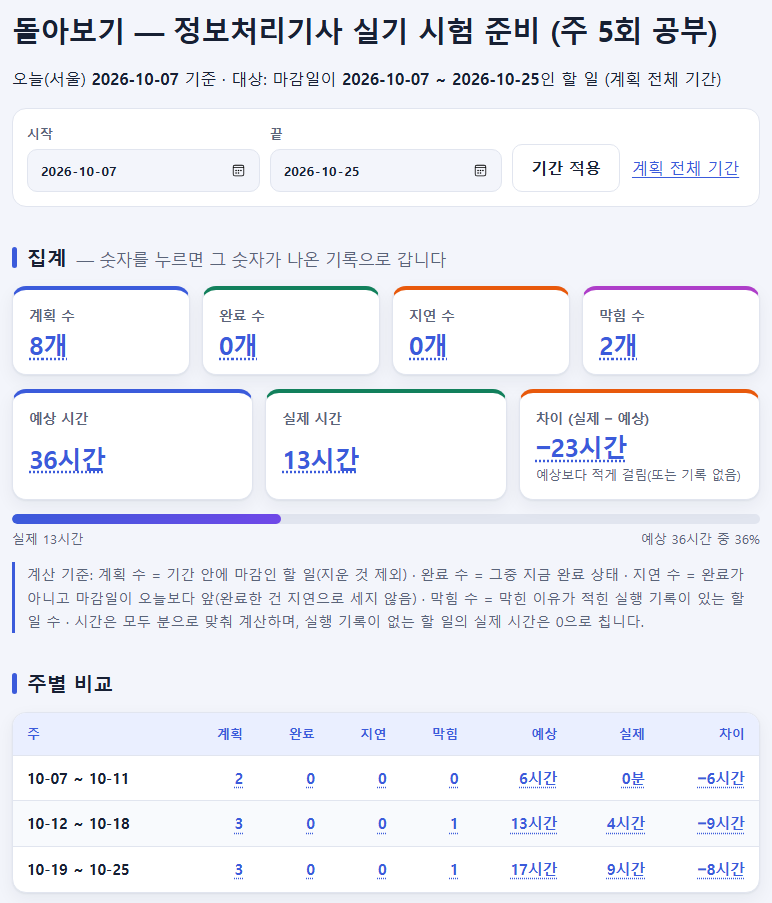
- 계획 8 · 완료 0 · 지연 0 · **막힘 2** · 예상 36시간 · **실제 13시간**(5+4+4) · 차이 −23시간. 막힘 2는 10/3(Java)·10/5(모의고사) 기록에서 나온 것이고, 주별 표에도 각각 10/12~18주·10/19~25주에 들어갑니다.
- 지연이 0인 이유: 아직 마감이 지난 할 일이 없습니다(오늘은 10/7).

**2. 숫자를 눌러 도착한 근거 기록**
- "막힘 수 2"를 누른 화면 — 막힌 이유와 시각이 적힌 실행 기록이 나옵니다: 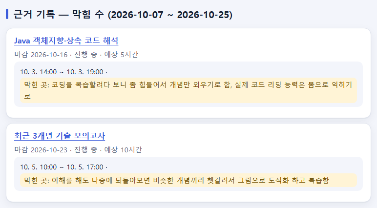
- "예상·실제 시간"을 누른 화면 — 할 일마다 예상 vs 실제와 실행 기록: 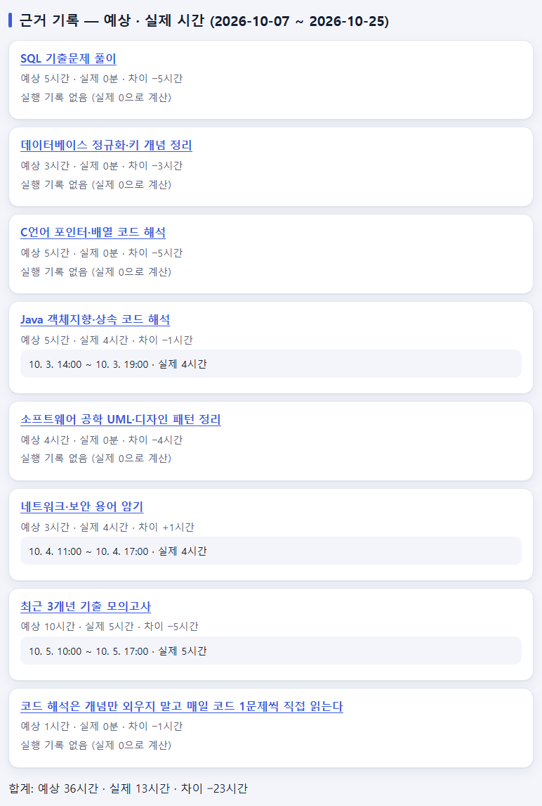

**3. 다음 계획으로 넘어간 한 줄**
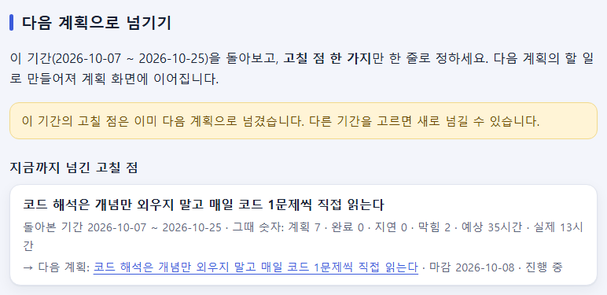
- 고칠 점: **"코드 해석은 개념만 외우지 말고 매일 코드 1문제씩 직접 읽는다"** (내가 10/3 기록에 쓴 "실제 코드 리딩 능력은 몸으로 익히기로"에서 가져옴)
- 넘어간 곳: 같은 계획의 새 할 일 (마감 10/8 · 높음 · 1시간 · 태그 `돌아보기`). 넘기던 순간의 숫자(계획 7 · 완료 0 · 지연 0 · 막힘 2 · 예상 35시간 · 실제 13시간)가 함께 저장됩니다. 위 정렬 사진의 맨 아래 카드에서도 "돌아보기에서 넘어온 고칠 점" 표시를 볼 수 있습니다.
---

## 카드 5 — 내 것으로 채우고, 잃지 않게

### 만든 것
- **공개 안내**: 모든 화면 맨 위에 같은 문장 — "지금은 로그인이 없어 링크를 아는 사람은 누구나 볼 수 있습니다. 남이 봐도 괜찮은 내용만 넣으세요." (`app/PublicNotice.tsx` 한 곳에서 관리)
- **내보내기**: 첫 화면의 "내 자료 전체를 파일 하나로 내보내기" 또는 `/api/export` → `plan-do-see-export-YYYY-MM-DD.json` 한 개. 6개 표(계획·계획 이력·할 일·실행 기록·완료 기록·돌아보기) 전체와 행 수, 시간대·단위 설명이 들어 있습니다. 요청할 때마다 DB에서 읽고(`no-store`), 파일은 `attachment` + `nosniff`로 내려갑니다.
- **최종 DB 계약**: [`contracts/pds-schema-v2.json`](contracts/pds-schema-v2.json) — 표·컬럼·타입·관계·날짜 규칙(시각은 UTC 저장·서울 표시, 날짜는 서울 달력 날짜)·단위(시간/분)·집계 정의. 실제 DB와의 일치는 `contracts/check-contract.mjs`로 대조했습니다(아래).
- **보안 헤더**: `X-Content-Type-Options: nosniff`, `X-Frame-Options: SAMEORIGIN`, `Referrer-Policy`.

### 점검 결과
| 점검 | 방법 | 결과 |
|---|---|---|
| 계약 ↔ 실제 DB | `information_schema.columns`를 뽑아 계약과 컬럼명·타입·null 허용을 대조 | 6개 표 51개 컬럼 **전부 일치** |
| 새로고침/재시작 뒤 값 (T06-C35) | 개발 서버를 완전히 껐다 켠 전후로 내보내기 두 번 → 비교 | **완전히 동일** (ID·날짜·값·단위). 서울 09:00 입력이 UTC 00:00으로 저장된 것도 확인 |
| 스크립트 모양 글자 (T06-C57) | 제목에 `<script>…</script>`, 태그에 `<b>굵게</b>`, 막힌 이유에 ``를 저장 | 계획 화면·돌아보기 근거 목록·내보낸 파일 모두에서 **글자 그대로** 보임. `script/img/b` 요소 0개, 실행 표지(`window.__xss`) 없음 → 화면: [`docs/card5-xss-literal.png`](docs/card5-xss-literal.png) (시험 데이터는 지움) |
| 비밀값 — Git 기록 (T06-C58) | `git log --all -p`(8개 커밋 전부)와 추적 파일에서 `sb_secret_…`·`sb_publishable_…`·`eyJ….….…` 형식 검색 | **0건**. `.env.local`은 `.gitignore`로 제외, 추적되는 env 파일은 `.env.example`(자리표시자)뿐 |
| 비밀값 — 배포 파일·응답 | 운영 주소의 HTML 3쪽 + `/api/export` + 자바스크립트·CSS 9개를 내려받아 위 형식과 `service_role`/`SERVICE_ROLE_KEY` 글자 검색 | 13개 대상 **0건** |
| 비밀값 — 네트워크·콘솔 | 운영 화면을 브라우저로 열어 요청 목록·콘솔 확인 | 요청은 모두 같은 도메인(`plan-do-see-06.vercel.app`), `supabase` 주소로 가는 요청 **0건**, 콘솔 메시지 없음 |
| 로그인 없이 열림 (T06-C01) | 쿠키·로그인 없이 요청 | 결과물 주소·`/api/export`·GitHub 저장소·raw 파일 모두 200, 로그인/인증 문구 없음 |

> 비밀 키(`service_role`/secret)는 Vercel 환경변수와 내 PC의 `.env.local`에만 있고, 브라우저는 DB에 직접 접근할 수 없습니다(anon 권한 회수 + RLS).

### 통과 기준 확인
- [x] T06-C34 계획·할 일·실행 기록·돌아보기 자료가 서버 DB에 저장됨 (코드·DB 확인 완료)
- [x] T06-C35 새로고침 뒤 같은 값으로 복원
- [x] T06-C78 내가 실제로 세운 계획이 하나 이상 — 정보처리기사 실기 준비
- [x] T06-C79 그 계획에 딸린 할 일 다섯 개 이상 — 7개 (내가 "그대로 OK"로 확인) + 돌아보기에서 넘어온 1개 = 8개
- [x] T06-C80 실제로 한 일 기록 세 개 이상 — 10/3 · 10/4 · 10/5에 내가 실제로 공부한 3건
- [x] T06-C81 돌아보기가 그 자료로 채워지고 숫자가 모두 0은 아님 — 계획 8 · 막힘 2 · 실제 13시간 등
- [x] T06-C36 자료 전체를 파일 하나로 내보내기
- [x] T06-C82 첫 화면에 공개 안내 문구
- [x] T06-C58 비밀키 원문이 어디에도 없음
- [x] T06-C57 스크립트 모양 글자가 글자 그대로 보임
- [x] T06-C59 짧은 확인 방법 4줄 (아래 제출문)
- [x] T06-C60 AI와 내 판단 3줄 (아래 제출문)
- [x] T06-C01 제출 URL이 로그인 없이 열림

### 남길 것 (증거) — 카드 5

**1. 내 계획·내 할 일·내 실행 기록이 실제로 들어 있는 화면**
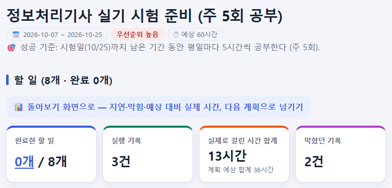
(할 일 카드와 실행 기록은 카드 2·3의 사진, 돌아보기는 카드 4의 사진 참고)

**2. 첫 화면에 적어 둔 공개 안내**
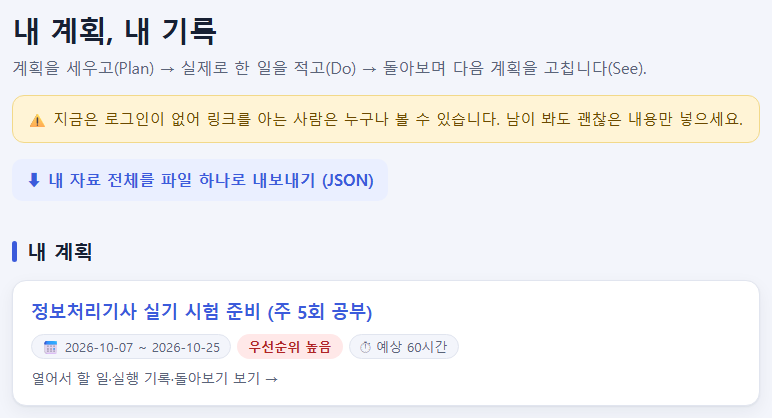

**3. 내보낸 파일 한 개와, 새로고침 뒤에도 값이 그대로인 결과**
- 내보낸 파일: [`docs/plan-do-see-export-2026-10-07.json`](docs/plan-do-see-export-2026-10-07.json) (운영 서버의 `/api/export`에서 받은 그대로, 6개 표 전부)
- 행 수: 계획 1 · 계획 이력 2 · 할 일 8 · 실행 기록 3 · 완료 기록 0 · 돌아보기 1
- 같은 파일을 **20초 간격으로 두 번** 받아 `exported_at`만 빼고 비교 → **완전히 동일**. 실행 기록 시각은 서울 10/3 14:00 → `2026-10-03T05:00 UTC`로 저장돼 있어 "UTC 저장·서울 표시" 규칙대로입니다.

**4. 스크립트 모양 글자와 비밀값 점검 결과** — 위 "점검 결과" 표와 [`docs/card5-xss-literal.png`](docs/card5-xss-literal.png)

---

## 제출문

- 결과물 주소: https://plan-do-see-06.vercel.app
- 소스 주소: https://github.com/terran1234/plan-do-see-06

### 짧은 확인 방법 (4줄)
1. **어디로 가나요**: https://plan-do-see-06.vercel.app — 로그인 없이 열립니다.
2. **세 단계 안에 무엇을 하나요**: ① 계획 "정보처리기사 실기 시험 준비"를 눌러 할 일의 "실행 기록 남기기"로 한 일을 저장 → ② "돌아보기 화면으로"에서 숫자를 눌러 근거 기록 확인 → ③ 고칠 점 한 줄을 적어 "다음 계획으로 넘기기" (첫 화면의 "내 자료 내보내기"로 파일도 받을 수 있음).
3. **무엇이 보이면 통과인가요**: 모든 화면 위의 노란 공개 안내, 계획·할 일 5개 이상·실행 기록 3개 이상, 0이 아닌 돌아보기 숫자와 숫자를 누르면 나오는 근거 기록, 넘어온 "고칠 점" 할 일, 새로고침해도 그대로인 값, 내려받아지는 JSON 파일 하나.
4. **안 될 때는 무엇이 보이나요**: 목록을 못 읽으면 빨간 글씨 "…불러오지 못했습니다. 잠시 후 다시 시도하세요", 입력이 틀리면 칸 위에 빨간 안내(예: "끝난 시각이 시작 시각보다 빠릅니다"), 완료를 중복해 누르면 "이미 완료된 할 일입니다. 완료 기록은 한 건만 남습니다."

### AI와 내 판단 (3줄)
1. **AI에게 맡긴 일**: 앱 설계·구현(Next.js + Supabase + Vercel), DB 표·제약·함수 작성, 저장소·DB·배포 설정 조작, 테스트와 증거 화면 촬영, README 작성, 그리고 돌아보기 "고칠 점" 한 줄을 내 기록에서 골라 문장으로 만드는 일.
2. **내가 직접 판단한 일**: 어떤 계획을 쓸지(정보처리기사 실기, 주 5회·10/25까지·평일 5시간·우선순위 높음), 할 일 7개가 맞는지 확인("그대로 OK"), 내가 실제로 공부한 기록 3건의 시간과 막힌 곳, 추천 기술 조합을 받아들일지, 새 Supabase 프로젝트를 만들지, GitHub 앱 권한·본인 확인·비밀 키 입력 같은 보안 단계를 직접 처리, 증거 촬영을 모든 카드가 끝난 뒤 한 번에 하기로 한 것.
3. **AI 제안을 따르지 않은 일**: (a) 저장소 생성과 환경 설정을 직접 하라는 AI의 제안을 따르지 않고 AI가 대신하게 요청함, (b) 고칠 점 한 줄을 직접 정하라는 AI의 권유를 따르지 않고 AI가 내 기록에서 골라 넣게 함.
